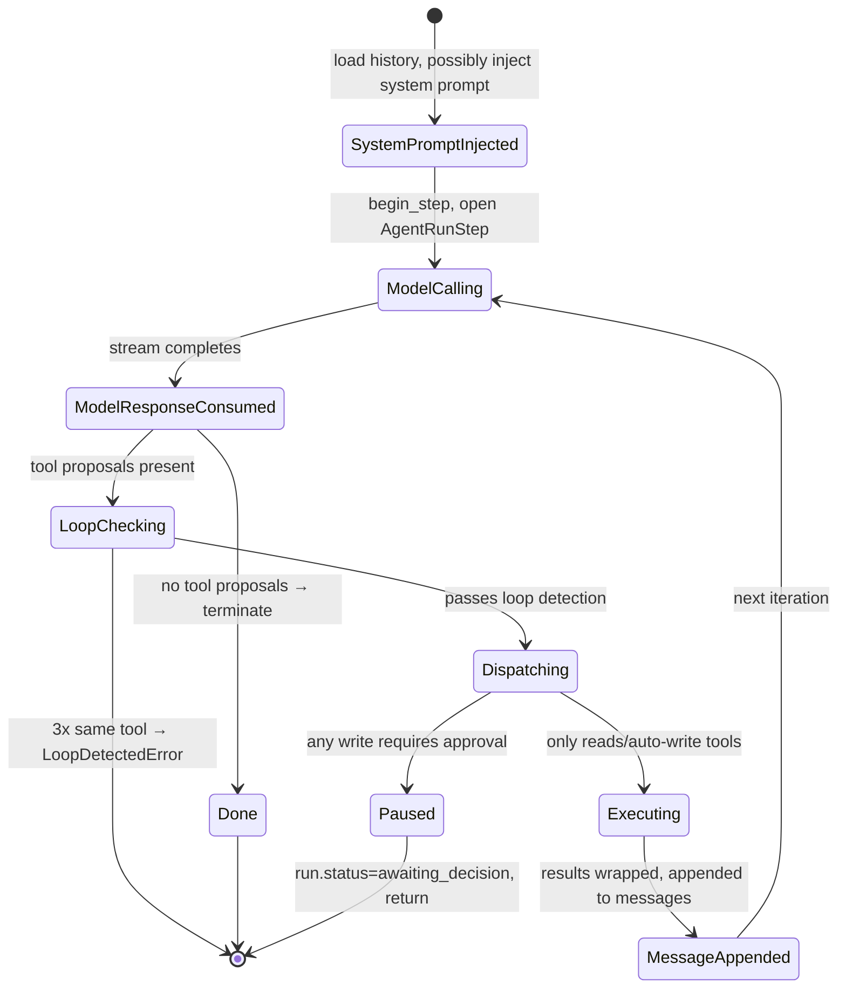
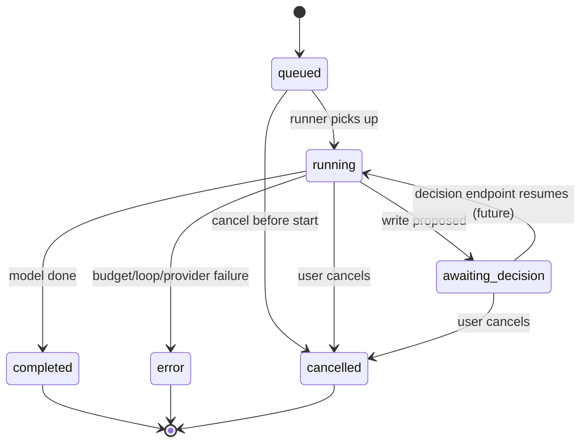

# Part 4 — AI Agent Architecture

> Seven chapters that step away from "what's in the file" and look at "why the patterns work." If Part 3 was the dissection table, Part 4 is the textbook of anatomy: the system as designed organism, not as catalog of organs.

---

## Chapter 28 — The Run Loop, Frame by Frame

### 28.1 The loop as state machine

The run loop is best understood as a state machine running inside one `ModelRunner.run()` call. The states are not the run statuses (`queued`, `running`, etc.) — those are *external* states observed by HTTP clients. The internal states are:



This is the **inner loop**. The **outer loop** (across HTTP requests for one conversation) is different and not visible here.

### 28.2 The five primitive operations

Inside the loop, the runner only does five things:

| Operation | When |
|---|---|
| **Reason** — call the LLM | Every step |
| **Decide** — does the model want a tool, or is it done? | After each model call |
| **Dispatch** — sort proposals into readers, writers, errors | When proposals exist |
| **Act** — execute reads in parallel, writers serial | When dispatch produces work |
| **Observe** — append tool results back to messages | After each execution wave |

If you wanted to extend xFRAME with a new capability (e.g., "let the model schedule a future tool call"), you'd add a sixth primitive. Currently there are five.

### 28.3 What the model sees on each iteration

The model receives a growing list of messages. After iteration N:

```
[system]    "You are xFRAME AI Agent..."          (added at start)
[user]      "Create a quote for Acme"             (from history)
[assistant] "I'll look that up. [tool_use #1]"    (from N=1)
[tool]      <tool_output #1>{result of #1}</tool_output>  (from N=1)
[assistant] "Found customer. Now corridors. [tool_use #2]"  (from N=2)
[tool]      <tool_output #2>{result of #2}</tool_output>
...
```

Notice the conversation is **always growing**. Every iteration adds one or two messages. Token consumption grows roughly linearly per step.

This is why `MAX_INPUT_TOKENS_PER_RUN` and the per-step token usage check matter.

### 28.4 What if the model is silent?

If the model emits no `text_delta` and no `tool_use`, just `usage`:

- `proposals` is empty.
- `assistant_text` is empty.
- The runner branches to the "done" path.

This terminates the run cleanly with `v1.run.completed`. The model effectively said "nothing more to do."

A model that "gives up" early is fine. A model that responds with no tool calls when there's clearly work to do is a prompt-engineering bug, not a runtime bug.

### 28.5 What about retries?

There are three places retries could happen:

| Layer | Retry mechanism | Where |
|---|---|---|
| HTTP to provider | none (timeout → failover) | `ProviderFailoverRouter` |
| HTTP to PriceFRAME | exponential backoff, up to 2 retries | `PriceFrameClient._request` |
| Agent loop level | none — model decides on the next iteration | `ModelRunner.run()` |

Notably, the **agent doesn't retry the same step**. If something fails, the failure becomes data the model sees on the next iteration, and the model decides whether to try again differently (a primitive form of self-correction enabled by §15.4).

---

## Chapter 29 — Tool Dispatch: Reads in Parallel, Writes in Serial

### 29.1 The asymmetry

Inside `_dispatch_proposals`, proposals fork:

- `tool.risk == "READ"` → `readers` list → `asyncio.gather` with semaphore.
- otherwise → `writers` list → serial loop.

This asymmetry has two justifications:

**Reads are commutative.** `get_quotation(42)` and `get_currency_rate("USD")` don't affect each other. Running them concurrently saves wall-clock time.

**Writes are not.** Two concurrent `update_corridor_pricing` calls on the same corridor could race PriceFRAME's change-history append. Serializing makes the audit log monotonic.

### 29.2 The semaphore

```python
sem = asyncio.Semaphore(self._settings.max_parallel_tool_calls)  # default 3

async def _exec_read(p, t, r, a):
    async with sem:
        return await self._execute_one(...)

done = await asyncio.gather(*(_exec_read(...) for r in readers))
```

The semaphore caps concurrency at `MAX_PARALLEL_TOOL_CALLS = 3`. Why a cap?

- **Per-host connection limits**: PriceFRAME, httpx pools, OS file descriptors.
- **Rate-limit friendliness**: don't burst 20 reads at once.
- **Failure isolation**: if all 20 reads hit a 5xx on PriceFRAME, only 3 are in-flight at once.

You'd raise this if you had a beefier PriceFRAME and read-heavy workloads. You'd lower it if PriceFRAME is fragile.

### 29.3 What if a read fails?

`asyncio.gather(..., return_exceptions=False)` — the first exception cancels the gather and propagates up.

But wait — `_execute_one` catches `PriceFrameError` and `ValueError`, returning a synthetic error `ToolExecutionResult` (§15.4). So a single tool failure doesn't tear down the gather; it returns a result with `{"error": ...}` payload.

What *would* tear down the gather is an unexpected exception (e.g., `KeyError`). That bubbles up to `ModelRunner.run()` which doesn't catch it — and the run dies with an unhandled exception trace. Roadmap improvement: catch `Exception` broadly in `_execute_one`.

### 29.4 Why writers don't use `asyncio.gather`

Even if you wanted to parallelize writes, you'd hit:

- Race conditions on PriceFRAME's `audit_logs` table.
- HMAC timestamp ordering — closely-timed callbacks could arrive out of order.
- Difficulty composing approvals — if one write requires approval, holding the others hostage gets weird.

The serial loop sidesteps all of this. Cost: marginally slower when the model proposes multiple writes.

### 29.5 The approval pause

```python
if requires_approval:
    run.status = "awaiting_decision"
    await append_run_event(... "v1.run.awaiting_decision", ...)
    return [], True  # paused
```

**Returning immediately** means subsequent proposals in the same model response are *not* dispatched. The model has to re-propose them on a future run after approval.

This is conservative — alternatives like "queue subsequent proposals as pending" exist but introduce reasoning complexity. Simple > clever for safety-critical paths.

---

## Chapter 30 — Human-in-the-Loop: The Pause-Resume Contract

### 30.1 The pause

A run pauses when:

1. The model emits a `tool_use` for a `LOW_RISK_WRITE` or `HIGH_RISK_WRITE` tool (default `requires_approval`), OR
2. A tool's `requires_approval(args, ctx)` override returns True.

The runner:

- Creates an `AgentToolCall(status="proposed", requires_approval=True)`.
- Emits `v1.tool.proposed` and `v1.run.awaiting_decision`.
- Sets `run.status = "awaiting_decision"`.
- Returns from `run()` immediately.

The HTTP request that triggered the run returns. The SSE stream emits the events. The client renders an approval card.

### 30.2 The resume (decision endpoint)

`POST /runs/{id}/decisions`:

```python
{
  "tool_call_id": "01HX...",
  "decision": "approve" | "reject" | "edit",
  "edited_args": { ... }   // only for "edit"
}
```

The handler:

1. Verifies `AgentToolCall` is in `status="proposed"` and belongs to a run the user owns.
2. **Reject**: marks `status="rejected"`, emits `v1.tool.rejected`, returns.
3. **Edit**: validates `edited_args` against `tool.input_model`, updates `args`, emits `v1.tool.edited`, falls through to execute.
4. **Approve / Edit-then-approve**: executes the tool via `PriceFrameClient`, emits `v1.tool.completed` on success.

After a successful write, it posts the HMAC-signed audit callback and stores the returned `priceframe_audit_log_id`.

### 30.3 The "doesn't resume the model" gap

After the write executes, the *model* should see the result and continue planning. Today, the decisions endpoint doesn't restart `ModelRunner.run()`. The conversation effectively pauses until the user sends a new message.

Why? Because resuming would require:

- Re-loading history including the just-completed write.
- Re-building the system prompt (needs current context).
- Spinning up another `ModelRunner` with a fresh `PriceFrameClient`.
- Handling the resumption transactionally with the decision.

It's a half-day of work — roadmap §15.6. For v1 the workflow is: user approves → frontend prompts "Continue?" → sends a new message → new run sees the tool result in history.

### 30.4 The contract in pseudo-protocol

```
client → POST /runs (creates Run #1)
client → GET /runs/{id}/stream
  ⟵ SSE: v1.tool.proposed(create_quotation, args)
  ⟵ SSE: v1.run.awaiting_decision

[user reviews on phone]

client → POST /runs/{id}/decisions {approve}
  PriceFRAME POST /api/quotes (with Idempotency-Key)
  PriceFRAME POST /api/v1/agent-audit-callbacks (HMAC)
  ⟵ HTTP 200 {success: true, result: {quote_id: 5042}}
  ⟵ SSE: v1.tool.completed

[stream closes — run is in awaiting_decision still, but the *tool* is done]

client → POST /conversations/{id}/messages "Continue."
  ⟵ HTTP 200 (new Run #2)
client → GET /runs/{id}/stream (Run #2)
  ⟵ SSE: model sees history including succeeded create_quotation
  ⟵ SSE: model proposes next step ("Now add corridors...")
```

The protocol works. It's just chattier than ideal.

### 30.5 Why HITL is the right primitive

You could imagine many alternatives:

- **Confidence-based auto-approval**: if model is "very sure," skip approval.
- **Threshold-based**: only require approval for writes above $X.
- **Just-in-time risk scoring**: ML model decides per-call.

xFRAME picks **all-writes-pause**. Why?

- **Simplicity** — one rule, easy to reason about.
- **Defense-in-depth** — even if every other layer fails, the human is the backstop.
- **Compliance** — auditors love deterministic approval gates.
- **Trust building** — users learn the model is honest about what it's about to do.

You can add tiering later (§15.20: per-user budgets). Starting strict and relaxing later is safer than the reverse.

---

## Chapter 31 — Provider Failover Internals

### 31.1 The contract

Every Provider implements:

```python
def stream(messages, tools, *, model, max_output_tokens) -> AsyncIterator[StreamEvent]
```

The router calls this. If it succeeds (yields events to completion), great. If it raises `ProviderError(failover=True)` or times out, the router tries the next provider.

### 31.2 The health table

```python
_health: dict[str, ProviderHealth] = {}

@dataclass
class ProviderHealth:
    unhealthy_until_epoch: float = 0.0

def mark_unhealthy(self, name):
    self._health[name] = ProviderHealth(
        unhealthy_until_epoch=(utc_now() + timedelta(seconds=300)).timestamp()
    )

def _healthy_providers(self):
    now = utc_now().timestamp()
    return [p for p in self.providers if self._health.get(p.name, ProviderHealth()).unhealthy_until_epoch <= now]
```

In-memory. Lost on restart. For multi-replica deploys you'd back this with Redis to share health across processes — currently each replica learns independently.

### 31.3 Timeout vs error

```python
try:
    async with asyncio.timeout(30.0):
        async for event in provider.stream(...):
            yield event
    return
except ProviderError as exc:
    if not exc.failover:
        raise   # don't try next provider for unrecoverable
    self.mark_unhealthy(provider.name)
except TimeoutError:
    self.mark_unhealthy(provider.name)
```

Two failure modes:

- **Soft failure** (`ProviderError(failover=True)`, timeout): mark unhealthy, try next.
- **Hard failure** (`ProviderError(failover=False)`): re-raise, don't try alternatives.

The latter is used for unrecoverable errors like "API key invalid" — no point trying again, no point trying the next provider with the same problem (if both share auth misconfiguration).

### 31.4 Single-model limitation revisited

The model name flows through unchanged:

```python
runner._model = "gemini-2.5-flash"
↓
router.stream(model="gemini-2.5-flash")
↓
provider.stream(model="gemini-2.5-flash")  # whichever provider answered
```

If Vertex fails over to Anthropic, Anthropic receives `"gemini-2.5-flash"` and 400s. The router catches it (`ProviderError`) and marks Anthropic unhealthy too. Now no providers are healthy → the run fails with `cause=provider_error`.

**Mitigation today**: deploy with only one provider configured. Both providers configured + same `default_model` is a hidden landmine.

**Future fix**: each provider has its own default model in settings. The router or runner pairs `(provider, model)` correctly.

### 31.5 The 30-second timeout

The router wraps `provider.stream` in `asyncio.timeout(30.0)`. Why 30s?

- LLM TTFT (time to first token) is usually <2s.
- A long agent response with many tool_use blocks might take 10-20s.
- 30s is well past normal but short enough to fail fast.

If your tasks consistently take longer, raise the timeout (current code has it as a default arg; not settings-driven).

### 31.6 The 300-second quarantine

After a failure, the provider is unhealthy for 5 minutes. Why?

- Most transient issues (regional outage, rate-limit burst) resolve in minutes.
- Repeatedly probing a sick provider is wasted latency for every user.
- 5 minutes is short enough that a forgotten flap recovers quickly.

If you wanted aggressive recovery, you'd add a "probe" mechanism — once per quarantine period, send a synthetic request to test.

---

## Chapter 32 — Budget Enforcement and Loop Detection

### 32.1 The five hard ceilings

| Ceiling | Default | Why |
|---|---|---|
| Steps | 10 | Prevents the model from chaining too many round-trips |
| Tool calls | 15 | Independent ceiling — could be higher than steps if multi-tool/step |
| Input tokens | 50,000 | Caps cost from large histories |
| Output tokens | 8,000 | Caps cost from verbose responses |
| Cost (USD) | $0.60 | Direct dollar cap |
| Wall clock | 60s | UX — users wait at most a minute |

All raise `BudgetExceededError` with a `cause` string. The runner catches and finalizes with `v1.run.error {cause: ..., budget: {...}}`.

### 32.2 The soft cost ceiling — unused for now

`COST_SOFT_PER_RUN_USD = $0.15` exists (`LoopBudget.soft_cost_breached()`) but no code currently checks it. Intended use: emit a warning event or metric when a run is "expensive but not killed." Currently dormant.

### 32.3 Why ceilings vs throttling

Two ways to limit cost:

- **Throttle**: slow down a runaway agent (e.g., insert delays).
- **Ceiling**: kill it at a fixed limit.

Throttling preserves the run; ceilings kill it. xFRAME picks ceilings because **a runaway agent is usually broken**, not just slow. Killing it lets the user see the error and try a smaller request.

### 32.4 Cost computation

```python
MODEL_COST_TABLE = {
    "gemini-2.5-flash": (0.0001, 0.0004),
    "claude-haiku-4-5": (0.0008, 0.004),
}
DEFAULT_COST = (0.0005, 0.002)

cost_usd += (input_tokens * in_rate + output_tokens * out_rate) / 1000.0
```

Pricing is per 1K tokens. When vendors change pricing, update this table. There's no automated sync — a known maintenance burden.

### 32.5 Loop detection

```python
recent: list[tuple[str, str]] = []
for call in proposals:
    signature = (call.name, json.dumps(call.args, sort_keys=True))
    recent.append(signature)
    recent[:] = recent[-3:]
    if len(recent) == 3 and len(set(recent)) == 1:
        raise LoopDetectedError(call.name)
```

If the same `(tool_name, args)` appears 3 times in a row, abort. Why 3 and not 2?

- 2 is too aggressive — legitimate "retry the same query" patterns trip it.
- 3 is the smallest number that strongly suggests a loop.
- 4+ wastes more budget before catching.

The check is per-iteration, not across all proposals in one step. If the model emits `[get_X, get_X, get_X]` in one step, that's three signatures, and we trip the guard. If it emits `[get_X, get_Y, get_X]`, we don't.

### 32.6 What triggers loops?

Common causes:

- **Stale data** — model expects to find something; doesn't; tries again with same args.
- **Bad error message** — tool returned an error the model doesn't understand; retries identically.
- **Prompt drift** — system prompt is too vague; model fixates.

§15.4 (feed errors back to model) addresses the second cause directly.

---

## Chapter 33 — Durable Event Sourcing for Replay

### 33.1 What is event sourcing?

Event sourcing is a persistence pattern where you store **state transitions** (events) instead of just current state. To know "where the system is now," you replay events.

Pros:

- **Auditability** — every change is recorded.
- **Replayability** — disconnected clients catch up.
- **Time travel** — query "what did the system look like at T?"
- **Decoupling** — multiple consumers process events independently.

Cons:

- **Storage** — events accumulate; you don't delete.
- **Complexity** — derived views (current state) require projection logic.

### 33.2 xFRAME's event sourcing

`agent_run_events` is append-only:

```sql
CREATE TABLE agent_run_events (
    id          INTEGER PRIMARY KEY AUTOINCREMENT,
    run_id      VARCHAR(26) NOT NULL REFERENCES agent_runs(id) ON DELETE CASCADE,
    seq         INTEGER NOT NULL,
    event_type  VARCHAR(128) NOT NULL,
    payload     JSON NOT NULL DEFAULT '{}',
    created_at  TIMESTAMP WITH TIME ZONE DEFAULT now(),
    UNIQUE(run_id, seq)
);
```

The `(run_id, seq)` unique constraint enforces monotonic ordering. The `seq` column is computed atomically:

```python
seq = MAX(seq) + 1 WHERE run_id = ?
```

Concurrent appends within one run would fail the constraint — but each run is single-threaded, so this is theoretical.

### 33.3 The SSE replay

`GET /runs/{id}/stream` reads from this table. Client sends `Last-Event-ID: 17`:

```python
events = await list_run_events(session, run_id=run_id, after_seq=17, limit=2000)
for e in events:
    yield {"id": e.seq, "event": e.event_type, "data": json.dumps(event_payload(e))}
```

Multi-subscriber friendly. Mobile + web + admin debugger can all subscribe to the same run.

### 33.4 What about non-event state?

Not everything is an event. `agent_tool_calls.status` is **mutable**:

```
status: proposed → succeeded
```

Two updates to one row. Not append-only.

Why? Because the tool call has a long lifecycle (proposed → awaiting → executed) and storing every transition as an event would clutter the journal. The events emitted alongside (`v1.tool.proposed`, `v1.tool.approved`, `v1.tool.completed`) capture transitions; the row holds final state.

This is a hybrid: events for the audit trail, mutable rows for current state.

### 33.5 What never goes in events

- **Secrets** — never log a JWT, never log `priceframe_service_secret`.
- **PII** — already redacted upstream; double-check tool result payloads.
- **Huge blobs** — tool result is `project_for_model`-trimmed before going in `v1.tool.completed`.

### 33.6 Event retention

Today, events never expire. The table grows linearly with run count. At 10 events per run, 1000 runs/day, you accumulate 3.65M events/year. SQLite handles that; Postgres handles much more.

For very large deployments, partition by month:

```sql
CREATE TABLE agent_run_events_2026_05 PARTITION OF agent_run_events
FOR VALUES FROM ('2026-05-01') TO ('2026-06-01');
```

Drop old partitions when retention policy says.

---

## Chapter 34 — State Machine: Every Run Status Transition

### 34.1 The eight status values

```
queued → running → completed
                → error
                → cancelled
                → awaiting_decision → running → ...
```

| Status | Meaning | Set by |
|---|---|---|
| `queued` | Created, not yet started | `create_run_record` |
| `running` | Being processed | `AgentLoop.run` / `ModelRunner.run` entry |
| `awaiting_decision` | Paused for HITL | `ModelRunner._dispatch_proposals` when requires_approval=True |
| `completed` | Success | `ModelRunner.run` no-proposals path |
| `error` | Terminal failure | `_finalize_error` |
| `cancelled` | User-cancelled | `POST /runs/{id}/cancel` |

### 34.2 Allowed transitions



Three terminal states: `completed`, `error`, `cancelled`. No transitions out.

### 34.3 Concurrency considerations

What if two HTTP requests modify the same run?

- `POST /runs/{id}/decisions` (approve) → updates `AgentToolCall.status`
- `POST /runs/{id}/cancel` → sets `run.status = "cancelled"`

If they happen concurrently, both could read `status="awaiting_decision"` and write conflicting changes. SQLAlchemy's default isolation handles this acceptably for the moment, but a hardened version would use `SELECT FOR UPDATE` or explicit transaction retries.

Today, the assumption is one user → one run interaction at a time. If you have admin tooling that operates on runs, be aware.

### 34.4 The "stuck run" problem

If a process crashes mid-run, the run stays in `running` with no further events. A reaper job could detect this:

```sql
UPDATE agent_runs
SET status = 'error', error = 'reaper: stuck > 10x wallclock', completed_at = NOW()
WHERE status IN ('queued', 'running')
  AND updated_at < NOW() - INTERVAL '600 seconds';
```

Roadmap §15.9. Not implemented yet.

### 34.5 What clients see

Clients should treat the **events** as primary truth, not the run status. The status is a summary; the events are the ledger.

Pattern:

```js
// Mobile client
let lastEventId = 0;
const source = new EventSource(`/runs/${id}/stream?token=${jwt}&last_event_id=${lastEventId}`);
source.onmessage = (e) => {
    lastEventId = e.lastEventId;
    handleEvent(JSON.parse(e.data));
};
source.addEventListener('v1.run.completed', () => source.close());
source.addEventListener('v1.run.error', () => source.close());
source.addEventListener('v1.run.awaiting_decision', () => {
    showApprovalCard();
    source.close();
});
```

Reconnect with `lastEventId` if the connection drops. The server replays missed events.

---

### Part 4 wrap-up

You now understand not just **what** the code does but **why** — the dispatch asymmetry, the failover semantics, the budget rationale, the event-sourcing trade-off, the state machine guarantees.

### 🔑 Part 4 takeaways

- Reads parallel + writes serial isn't aesthetic; it's a safety guarantee.
- HITL is the keystone defense; every "convenience" alternative trades it away.
- Provider failover is best-effort; single-model coupling is a known caveat.
- Budget ceilings are about *killing pathological behavior*, not throttling.
- Event sourcing makes the system replayable, auditable, debuggable — pay the storage cost.
- The status machine is small; learn it, leverage it.

### ✍️ Part 4 exercises

1. The runner serializes writes. Design an alternative that parallelizes "independent" writes (e.g., two tools on different quotes). What invariants must hold?
2. Sketch a Redis-backed `_health` map for `ProviderFailoverRouter`. What's the read/write protocol?
3. The decisions endpoint doesn't resume the runner. Implement the resumption flow as pseudo-code. What can go wrong?

### 📚 Part 4 further reading

- "Event Sourcing" by Martin Fowler (martinfowler.com).
- Anthropic's "Building Effective Agents" — patterns for orchestration.
- "Production Considerations for Real-Time AI Agents" — collected vendor whitepapers.

---

**End of Part 4.**

**Next:** [Part 5 — RAG and Knowledge Systems](./part-05-rag-knowledge-systems.md). Concept-heavy chapter applying RAG principles to a hypothetical xFRAME extension.
