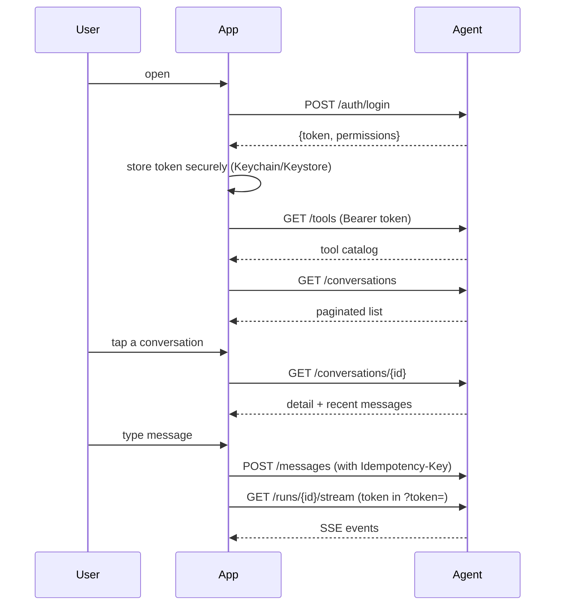

# Part 8 — Frontend and UX

> Four chapters. xFRAME's frontend lives in **separate repositories** — the Flutter mobile app and the PriceFRAME web panel. This part covers (a) what the API contract requires the frontend to do, (b) UX patterns that make agent interactions feel responsive, (c) how to render tool proposals as approval cards, and (d) the SSE quirks every mobile dev hits.

---

## Chapter 52 — Where the Frontend Lives

### 52.1 Two clients, one backend

xFRAME has two known clients in v1:

| Client | Repository | Tech | Role |
|---|---|---|---|
| **Mobile** | Separate Flutter repo | Dart, Flutter | Primary — sales reps on the road |
| **Web** | PriceFRAME repo `client/src/features/ai_agent/` | TypeScript, React (PriceFRAME's stack) | Embedded — admins debugging inside PriceFRAME |

Neither lives in this repo. That's deliberate: the agent ships as a **headless API + SSE service**. Frontends are downstream consumers.

### 52.2 The contract

Every frontend must:

- Implement **JWT-based auth** (Bearer header, optionally `?token=` for SSE).
- Handle **idempotency keys** on POSTs (every mutation should carry a UUID/ULID).
- Render **streaming events** from `GET /runs/{id}/stream`.
- Show **approval cards** for `v1.tool.proposed` events with `requires_approval=true`.
- Handle **error envelopes** of the form `{"error": {"code": ..., "message": ...}}`.

That's the minimum. Anything else is product polish.

### 52.3 Architectural choice: where does business logic live?

A common question in AI products: do prompts and tool definitions live in the **frontend** or **backend**?

**xFRAME's choice: 100% backend.** The frontend never sees a prompt, never knows the tool catalog directly (only via `GET /tools`), never builds tool args itself.

Why?

- **Security** — frontend code is reverse-engineerable. Prompts and HMAC secrets must stay server-side.
- **Consistency** — multiple frontends share one source of truth.
- **Iteration speed** — changing a prompt doesn't require a mobile app update.
- **A/B testing** — the backend can switch prompts dynamically; frontend just renders.

The frontend's job is **render + capture intent**. Not reason.

### 52.4 What the frontend gets from `GET /tools`

`GET /tools` (Chapter 18) returns per-tool descriptors:

```json
{
  "tools": [
    {
      "name": "create_quotation",
      "description": "Create a draft quotation in PriceFRAME.",
      "permission": "agent.quotes.create",
      "risk": "LOW_RISK_WRITE",
      "cost_class": "medium",
      "input_schema": { ... }
    },
    ...
  ]
}
```

Useful for the frontend to:

- Show "capabilities" hints to the user ("I can: create quotations, list corridors...").
- Generate help screens dynamically.
- Build forms when the user *manually* triggers a tool (rare; mostly the LLM does it).

Frontend should fetch this once at app startup or on auth change — don't fetch per message.

### 52.5 The session model



Standard CRUD over JSON + one persistent SSE per active run.

### 52.6 Token storage on mobile

Best practice:

- **iOS**: Keychain (`flutter_secure_storage`)
- **Android**: Keystore via EncryptedSharedPreferences (same package)
- **Never**: plain SharedPreferences, file system, in-app DB without encryption

For Flutter, the `flutter_secure_storage` package handles both platforms. Set on login; clear on logout.

### 52.7 Refresh-token rotation

Best practice the frontend should implement:

1. Track token expiry from the `expires_at` field in `/auth/login` response.
2. ~2 minutes before expiry, call `/auth/refresh` with the refresh token.
3. Atomically replace stored tokens.
4. If `/auth/refresh` returns 401, log out and redirect to login.

xFRAME's `/auth/refresh` is currently a passthrough to PriceFRAME. A future improvement is **agent-side rotation** so the agent can shorten the refresh window without coordinating with PriceFRAME.

### 🔑 Chapter 52 takeaways

- The frontend is **render + intent capture**. Business logic stays backend.
- `GET /tools` is the capability discovery endpoint — fetch once.
- Token storage: platform-secure (Keychain/Keystore), never plain.
- SSE uses `?token=` not headers because `EventSource` can't set headers.

---

## Chapter 53 — Designing for Streaming Token UX

### 53.1 Why streaming matters

Without streaming, the user types and waits 5-10 seconds for the full response. They wonder if the app froze. They tap again. They get angry.

With streaming, **the first token arrives in ~500ms**. The user sees something happening immediately. Even if the full response takes the same 5-10 seconds total, perceived latency drops dramatically.

This is **psychology, not engineering**. Same data, same speed — different user experience.

### 53.2 What streams from xFRAME

The SSE endpoint emits typed events:

| Event type | When | UI handling |
|---|---|---|
| `v1.run.started` | Run begins (AgentLoop only) | Show "thinking..." indicator |
| `v1.step.started` | Each loop iteration | Update progress |
| `v1.message.delta` | Assistant text persisted | Append to bubble |
| `v1.tool.proposed` | Tool args validated | Show approval card |
| `v1.tool.started` | Tool execution begins | "Looking up..." |
| `v1.tool.completed` | Tool succeeded | Optionally show snippet |
| `v1.tool.error` | Tool failed | Show retry hint |
| `v1.run.awaiting_decision` | Pause for human | Lock UI; show approval |
| `v1.run.completed` | Terminal success | Unlock; await next user msg |
| `v1.run.error` | Terminal failure | Show error |
| `v1.heartbeat` | Every 15s | Reset disconnect timer |

The frontend renders each one differently. The taxonomy is the contract.

### 53.3 The progressive disclosure pattern

A good agent UI **shows the agent thinking**:

```
User: "Show my open quotes"

Agent: [Looking up your quotes...]         ← v1.tool.started for list_my_quotations
       [Found 3 quotes]                    ← v1.tool.completed (subtle)
       You have 3 open quotations:         ← v1.message.delta begins
       1. Acme Q1 (...)                    ← delta continues
       2. Beta Ltd (...)                   ← delta continues
       3. Gamma Inc (...)                  ← delta complete
                                            ← v1.run.completed
```

Tool calls show as "actions the agent took" — subtle, distinct from chat bubbles. Assistant text streams character-by-character. The user sees competence.

Anti-pattern: hide all tool calls and only show the final answer. The user has no idea what the agent did or whether to trust it.

### 53.4 Token-level streaming vs message-level

There's a subtle distinction.

xFRAME emits `v1.message.delta` with the **full assistant message text** (not character-by-character chunks). Why?

- Backend persists `AgentMessage.content` only after the model finishes generating that text.
- One `v1.message.delta` per persisted message.
- Multiple messages per run if the model emits text → tool_use → more text.

So the SSE stream emits *message-level* deltas, not *token-level*.

If you want **token-level streaming** in the UI (typing animation), the frontend can:

- Receive `v1.message.delta` with full text.
- Animate the text-typing on the client side (~10-30 chars per frame).

This gives the visual effect of tokens streaming without requiring backend changes.

For *true* token-level streaming, you'd need to emit a delta event per token from the model — possible but adds complexity. Most product UX accepts the message-level approach.

### 53.5 The "thinking" indicator

While the model is producing the first message, show **something**. Options:

- "Looking up your quotes..." (specific, when a tool is in flight)
- "Thinking..." (generic, when no tool yet)
- A subtle animation (pulse, dots)

Update the indicator based on the latest event:

```
v1.run.started        → "Thinking..."
v1.step.started       → (no change)
v1.tool.started       → "Looking up <tool_name>..."
v1.tool.completed     → "Got it. Composing response..."
v1.message.delta      → indicator disappears; show text
```

The user understands the agent is actively working. This is *much* better than a generic spinner.

### 53.6 Latency budget

For a good UX, target:

| Phase | Budget |
|---|---|
| User taps send → first event | < 1s |
| First text appears | < 2s |
| Simple read complete (1 tool round) | < 5s |
| Complex flow with tool + approval | UX should pause naturally |

If you're hitting these, the agent feels alive. If first event takes >3s, users perceive lag.

Tuning levers:

- LLM provider region (Vertex `us-central1` from EU servers adds ~200ms).
- `MAX_PARALLEL_TOOL_CALLS` — higher = faster for multi-read responses.
- PriceFRAME latency — biggest factor if PriceFRAME is slow.
- Prompt size — smaller prompts = faster TTFT.

### 🔑 Chapter 53 takeaways

- Streaming is psychology: same data, better perceived speed.
- Render every event type meaningfully — don't hide tool calls.
- Message-level deltas + client-side typing animation = good enough.
- The user wants to see the agent thinking, not a blank wait.

---

## Chapter 54 — Surfacing Tool Proposals and Approval Cards

### 54.1 The approval card pattern

When `v1.tool.proposed` arrives with `requires_approval=true`, the frontend pauses normal chat and shows an **approval card**.

```
┌─────────────────────────────────────────────────────┐
│ ⚠ Pending action: Create Quotation                 │
│                                                     │
│ Title:       Acme India Q1                          │
│ Customer:    Acme Corp (ID 42)                      │
│ Currency:    USD                                    │
│ Notes:       (none)                                 │
│                                                     │
│ [ Reject ]  [ Edit ]  [ Approve ]                   │
└─────────────────────────────────────────────────────┘
```

Three buttons:

- **Approve** — POST `/runs/{id}/decisions {decision: "approve"}`.
- **Reject** — POST `/runs/{id}/decisions {decision: "reject"}`.
- **Edit** — open a form pre-filled with `args`, let user modify, POST `{decision: "edit", edited_args: {...}}`.

### 54.2 What the card shows

The `v1.tool.proposed` payload:

```json
{
  "tool_call_id": "01HX...",
  "tool_name": "create_quotation",
  "args": {
    "title": "Acme India Q1",
    "customer_id": 42,
    "currency": "USD"
  },
  "requires_approval": true
}
```

The frontend should:

1. **Display args in human-readable form.** "customer_id: 42" is opaque; "Customer: Acme Corp (ID 42)" is clear. Look up the customer name via a side call if needed.
2. **Highlight high-risk fields.** Spread, total amount, approval submission — call them out visually.
3. **Show consequences.** "This will create a permanent record." for `HIGH_RISK_WRITE`.

The frontend can fetch the tool's full schema from `GET /tools` for field labels and types.

### 54.3 The "Edit" flow

The most useful HITL feature: let the user **modify** before approving.

Edit dialog:

```
┌─────────────────────────────────────────────────────┐
│ Edit Create Quotation                               │
│                                                     │
│ Title:       [Acme India Q1                     ]   │
│ Customer ID: [42                                ]   │
│ Currency:    [USD]                                  │
│ Notes:       [                                  ]   │
│                                                     │
│ [ Cancel ]                          [ Approve Edit ]│
└─────────────────────────────────────────────────────┘
```

On submit, POST:

```json
{
  "tool_call_id": "01HX...",
  "decision": "edit",
  "edited_args": {
    "title": "Acme India Q1 - Revised",
    "customer_id": 42,
    "currency": "USD",
    "notes": "Annual refresh"
  }
}
```

The decisions endpoint validates `edited_args` against the tool's `input_model`. If invalid, returns 422. If valid, updates `AgentToolCall.args` and executes with the new values.

### 54.4 What about partial approvals?

If the model proposes multiple writes in one response (rare in xFRAME today; runner pauses after the first), should the UI batch them?

xFRAME's choice: **one approval at a time**, in sequence. The runner pauses after each requires-approval tool, so the UI never sees more than one pending approval per run.

This keeps the UX deterministic. Multi-pending-approval UIs ("approve all 3?") get confusing fast.

### 54.5 Showing the proposal in conversation context

Don't *only* show the card. Show it **inline in the conversation**:

```
[Assistant] I'll create the quotation. Please review:

           ┌──────────────────────────────────────┐
           │ Pending: Create Quotation            │
           │ Title: Acme India Q1                 │
           │ ...                                  │
           │ [Reject] [Edit] [Approve]            │
           └──────────────────────────────────────┘
```

The card is a special "message" in the chat stream. When the user approves, the card becomes:

```
[Assistant] I'll create the quotation. Please review:
           ✓ Approved: Create Quotation (Quote 5042 created)
```

The history is preserved. Scrolling back, the user can see what they approved.

### 54.6 Handling "lost approval" UX

What if the user closes the app while a run is `awaiting_decision`?

- The run stays paused indefinitely (no TTL today).
- On next app open, the frontend should fetch `GET /conversations/{id}` and `GET /runs/{run_id}/stream` with `Last-Event-ID: 0` to replay events.
- The `v1.run.awaiting_decision` event tells the UI to re-show the approval card.

This works because the **event log is the source of truth**. The frontend can resume from any point.

### 54.7 Edge case: the user wants to ignore an approval

If the user dismisses the approval card without choosing:

- The run stays `awaiting_decision`.
- On next message, the frontend should either:
  - Prompt: "You have a pending action. Approve, reject, or continue without it?"
  - Auto-reject and start a new run.
- Document which behavior your product wants.

Don't silently lose the pending state. The audit log won't be happy.

### 🔑 Chapter 54 takeaways

- Render approval cards inline in chat — keep history.
- Always provide Approve / Reject / Edit. Edit is the secret-sauce HITL feature.
- One approval at a time keeps UX deterministic.
- Resumption from `Last-Event-ID: 0` lets the app survive close-reopen.

---

## Chapter 55 — SSE on Mobile: `EventSource` Quirks

### 55.1 The `EventSource` API

The standard browser API for SSE is `EventSource`:

```js
const source = new EventSource(`https://agent.example.com/api/v1/agent/runs/${runId}/stream?token=${jwt}`);
source.addEventListener("v1.message.delta", (e) => {
    const data = JSON.parse(e.data);
    appendToBubble(data.delta);
});
source.addEventListener("v1.run.completed", (e) => source.close());
source.onerror = (e) => { /* reconnect */ };
```

Three quirks bite every dev.

### 55.2 Quirk 1 — Can't set custom headers

`EventSource` doesn't expose a header-setter API. There's no `EventSource(url, {headers: {Authorization: ...}})`.

**Workaround**: pass the JWT as a query parameter:

```js
new EventSource(`/api/v1/agent/runs/${id}/stream?token=${jwt}`);
```

xFRAME's `get_auth_context` extracts from both `Authorization` header AND `?token=` query param to support this.

⚠️ **Security concern**: query params land in proxy logs, browser history, referer headers. Mitigations:

- HTTPS only.
- Short-lived JWTs.
- Server logs configured to mask `?token=`.

The trade-off is unavoidable for browser SSE. Consider WebSockets if it's a deal-breaker (xFRAME doesn't, but it's an option).

### 55.3 Quirk 2 — Reconnect with `Last-Event-ID` is automatic but limited

Default behavior:

- On disconnect, `EventSource` reconnects automatically.
- It sends `Last-Event-ID: <last seen id>` as a header.

Sounds great, but:

- The exponential backoff is opaque (different browsers, different schedules).
- You can't change retry interval cleanly (the server can hint via `retry:` SSE field).
- After many failures, the browser may give up and call `onerror`.

For mobile WebViews wrapping a browser, this works. For native iOS/Android, you'll use a third-party SSE library or roll your own.

For Flutter, the package `eventsource` provides a reasonable client. Verify it handles `Last-Event-ID` correctly.

### 55.4 Quirk 3 — Heartbeats are essential

If you don't send heartbeats every 15-30 seconds, intermediate proxies (nginx, load balancers, mobile carriers) will close the connection thinking it's idle.

xFRAME emits `v1.heartbeat` every 15s by default (`SSE_HEARTBEAT_SECONDS`):

```
event: v1.heartbeat
data: {"run_id": "...", "seq": 42}
```

The frontend doesn't need to do anything with heartbeats — they exist to keep the TCP connection alive.

### 55.5 Reconnect loop pseudocode

A robust reconnect loop:

```js
function openStream(runId, jwt, lastEventId = 0) {
    const url = `/api/v1/agent/runs/${runId}/stream?token=${jwt}&last_event_id=${lastEventId}`;
    const source = new EventSource(url);

    let lastSeenId = lastEventId;
    let backoff = 1000;

    source.addEventListener("v1.run.completed", () => {
        source.close();
        onComplete();
    });

    source.addEventListener("v1.message.delta", (e) => {
        lastSeenId = parseInt(e.lastEventId, 10);
        handleMessageDelta(JSON.parse(e.data));
        backoff = 1000;
    });

    source.onerror = () => {
        source.close();
        setTimeout(() => openStream(runId, jwt, lastSeenId), backoff);
        backoff = Math.min(backoff * 2, 30000);
    };
}
```

Key points:

- **Track `lastSeenId` yourself.** Don't rely on browser internals.
- **Reset backoff on success.** Don't accumulate delay across recoverable blips.
- **Cap backoff.** 30s max — beyond that, treat as a real failure.

### 55.6 Background mode on mobile

When the app backgrounds:

- iOS: SSE connections typically suspend after ~30s.
- Android: similar.
- The agent run continues server-side.

When the app returns to foreground:

- Reopen the SSE stream with `Last-Event-ID` = last seen.
- Server replays missed events.
- UI catches up.

If you want to **notify the user** when a background run finishes, use **push notifications** (FCM/APNS). xFRAME has `agent_device_tokens` for this purpose, though the push pipeline isn't shipped in v1.

### 55.7 Polling fallback

In some networks, SSE is unreliable. A fallback:

```js
async function pollStream(runId, lastSeenId) {
    while (true) {
        const events = await fetch(`/api/v1/agent/runs/${runId}/events?after_seq=${lastSeenId}`)
            .then(r => r.json());
        for (const event of events) {
            handleEvent(event);
            lastSeenId = event.seq;
            if (event.event_type === "v1.run.completed") return;
        }
        await sleep(2000);
    }
}
```

xFRAME doesn't currently expose a polling endpoint for events (the SSE generator wraps the same data), but adding one would be a 20-line change. Worth considering if your mobile users have flaky networks.

### 55.8 Closing the stream cleanly

Always close the `EventSource` when done:

```js
source.close();
```

In Flutter, equivalent depending on the package. In React, do it in `useEffect` cleanup.

Leaving connections open consumes server resources. xFRAME's nginx config has `proxy_read_timeout 3600s` — connections can hang for an hour before forced disconnect. Not free.

### 🔑 Chapter 55 takeaways

- `EventSource` can't set headers — use `?token=` query param.
- Heartbeats every 15s prevent proxy disconnects.
- Robust reconnect tracks `lastSeenId` client-side, with exponential backoff.
- Background mode + push notifications is the long-running-run pattern.
- Always close the stream when done.

---

### Part 8 wrap-up

You now know the contract every xFRAME frontend must implement and the UX patterns that make agents feel alive.

### ✍️ Part 8 exercises

1. Sketch a Flutter widget for the approval card. What state does it hold? How does it call `/runs/{id}/decisions`?
2. Write the reconnect logic for SSE on Android. Include backoff, `Last-Event-ID`, and a kill switch (max retries).
3. Design the "tool call inline in chat" rendering. Define a `Message` type that can be assistant text *or* a tool proposal *or* a tool completion.

### 📚 Part 8 further reading

- MDN — `EventSource` API.
- Flutter `flutter_secure_storage` docs.
- Apple — Push Notifications for background updates.

---

**End of Part 8.**

**Next:** [Part 9 — Databases and Storage](./part-09-databases-storage.md).
