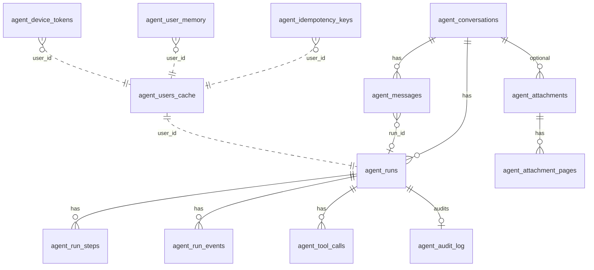
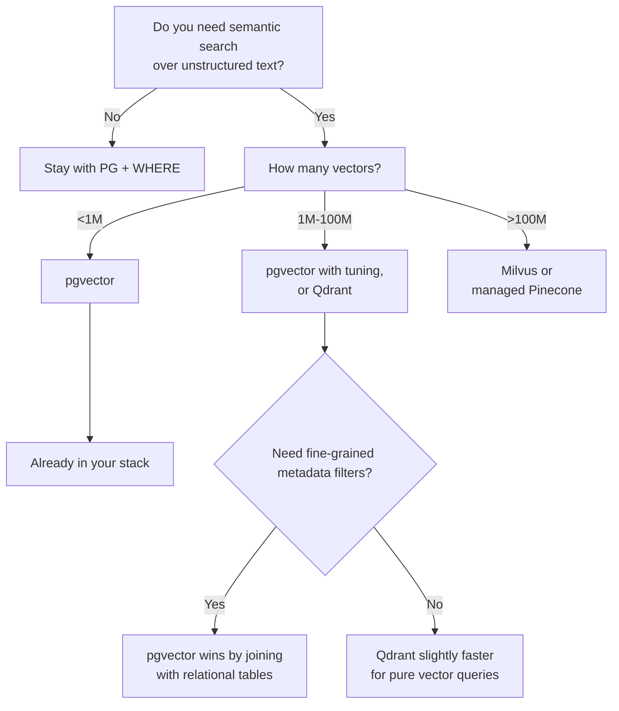

# Part 9 — Databases and Storage

> Six chapters on the persistence layer. Schema by table, async SQLAlchemy patterns, Alembic conventions, Redis usage, S3/MinIO for attachments, and when to add a vector database.

---

## Chapter 56 — PostgreSQL Schema, Table by Table

### 56.1 Map of the 11 tables



11 tables. Conversations branch into messages + runs. Runs branch into steps + events + tool calls. Cross-cutting tables: idempotency keys, user cache, audit log, memory, device tokens, attachments.

### 56.2 `agent_conversations`

```python
class AgentConversation(Base):
    __tablename__ = "agent_conversations"
    id: Mapped[str] = mapped_column(String(26), primary_key=True, default=ulid_now)
    user_id: Mapped[int] = mapped_column(Integer, nullable=False, index=True)
    title: Mapped[str] = mapped_column(String(200), default="New conversation")
    kind: Mapped[str | None] = mapped_column(String(64), nullable=True, default="general")
    pinned: Mapped[bool] = mapped_column(Boolean, default=False)
    archived: Mapped[bool] = mapped_column(Boolean, default=False)
    deleted_at: Mapped[datetime | None] = mapped_column(DateTime(timezone=True), nullable=True)
    created_at: Mapped[datetime] = mapped_column(DateTime(timezone=True), default=utc_now)
    updated_at: Mapped[datetime] = mapped_column(DateTime(timezone=True), default=utc_now)
```

Key columns:

- `id` is a **ULID** (26 chars, sortable, globally unique).
- `kind` (V1.4) routes to system prompts.
- `deleted_at` enables **soft delete** — rows aren't dropped, just flagged.
- `pinned` and `archived` are user preferences for UI.

### 56.3 `agent_messages`

```python
class AgentMessage(Base):
    __tablename__ = "agent_messages"
    id: Mapped[str] = mapped_column(String(26), primary_key=True, default=ulid_now)
    conversation_id: Mapped[str] = mapped_column(
        ForeignKey("agent_conversations.id", ondelete="CASCADE"), index=True,
    )
    user_id: Mapped[int] = mapped_column(Integer, index=True)
    role: Mapped[str] = mapped_column(String(32))            # user, assistant, system, tool
    content: Mapped[str] = mapped_column(Text)
    source: Mapped[str] = mapped_column(String(32))          # text, voice, attachment, agent
    run_id: Mapped[str | None] = mapped_column(String(26), nullable=True, index=True)
    created_at: Mapped[datetime] = mapped_column(DateTime(timezone=True), default=utc_now)
```

- `role` is the message role from the chat schema.
- `source` describes the channel (text typed, voice transcribed, file attached, agent-generated).
- `run_id` links a message to the run that produced it (assistant messages) or initiated it (user messages).
- Cascade delete on conversation removal — but only hard deletes; the soft-delete flag preserves messages.

### 56.4 `agent_runs`

```python
class AgentRun(Base):
    __tablename__ = "agent_runs"
    id: Mapped[str] = mapped_column(String(26), primary_key=True, default=ulid_now)
    conversation_id: Mapped[str] = mapped_column(
        ForeignKey("agent_conversations.id", ondelete="CASCADE"), index=True,
    )
    user_id: Mapped[int] = mapped_column(Integer, index=True)
    status: Mapped[str] = mapped_column(String(32))   # queued/running/awaiting_decision/completed/error/cancelled
    input_message_id: Mapped[str | None] = mapped_column(String(26), nullable=True)
    output_message_id: Mapped[str | None] = mapped_column(String(26), nullable=True)
    error: Mapped[str | None] = mapped_column(Text, nullable=True)
    created_at: ...
    started_at: ...
    completed_at: ...
    cancelled_at: ...
    updated_at: ...
```

The **state machine** for a run lives in `status`. Multiple timestamp columns track when each transition happened — useful for SLO dashboards.

- `input_message_id` points to the user message that triggered this run.
- `output_message_id` points to the last assistant message (overwritten as the run progresses).
- `error` is non-NULL when `status='error'`.

### 56.5 `agent_run_steps`

```python
class AgentRunStep(Base):
    __tablename__ = "agent_run_steps"
    id: Mapped[int] = mapped_column(Integer, primary_key=True, autoincrement=True)
    run_id: Mapped[str] = mapped_column(ForeignKey("agent_runs.id", ondelete="CASCADE"), index=True)
    seq: Mapped[int] = mapped_column(Integer)
    kind: Mapped[str] = mapped_column(String(32))   # model_call, tool_call
    status: Mapped[str] = mapped_column(String(32))
    created_at: ...
    completed_at: ...
```

A step is one iteration inside a run — either a model call or a tool call. The `seq` matches the `LoopBudget.steps` counter at the time the step started.

Steps are a coarser-grained record than events. Useful for "what was the agent doing at step 3?"

### 56.6 `agent_run_events`

```python
class AgentRunEvent(Base):
    __tablename__ = "agent_run_events"
    id: Mapped[int] = mapped_column(Integer, primary_key=True, autoincrement=True)
    run_id: Mapped[str] = mapped_column(ForeignKey("agent_runs.id", ondelete="CASCADE"), index=True)
    seq: Mapped[int] = mapped_column(Integer, nullable=False)
    event_type: Mapped[str] = mapped_column(String(128), nullable=False)
    payload: Mapped[dict[str, Any]] = mapped_column(JSON, nullable=False, default=dict)
    created_at: Mapped[datetime] = mapped_column(DateTime(timezone=True), default=utc_now)

    __table_args__ = (UniqueConstraint("run_id", "seq"),)
```

The **append-only audit trail**. Critical properties:

- **`(run_id, seq)` UNIQUE** — concurrent writers fail loudly.
- **`payload: JSON`** — flexible schema; new event types don't need migrations.
- **`autoincrement id`** — internal numbering; never exposed to clients (clients use `seq`).

Read patterns:

- `WHERE run_id = ? AND seq > ?` — SSE replay.
- `WHERE created_at > NOW() - INTERVAL '7 days' AND event_type = ?` — analytics.
- `WHERE run_id = ? ORDER BY seq` — full run reconstruction.

Index on `run_id` covers the first two; the unique constraint covers the third.

### 56.7 `agent_tool_calls`

```python
class AgentToolCall(Base):
    __tablename__ = "agent_tool_calls"
    id: Mapped[str] = mapped_column(String(26), primary_key=True, default=ulid_now)
    run_id: Mapped[str] = mapped_column(ForeignKey("agent_runs.id", ondelete="CASCADE"), index=True)
    step_id: Mapped[int | None] = mapped_column(Integer, nullable=True)
    tool_name: Mapped[str] = mapped_column(String(128))
    status: Mapped[str] = mapped_column(String(32))   # proposed/pending/succeeded/failed/rejected
    args: Mapped[dict[str, Any]] = mapped_column(JSON)
    result: Mapped[dict[str, Any] | None] = mapped_column(JSON, nullable=True)
    error: Mapped[str | None] = mapped_column(Text, nullable=True)
    requires_approval: Mapped[bool] = mapped_column(Boolean, default=False)
    priceframe_audit_log_id: Mapped[int | None] = mapped_column(Integer, nullable=True)
    approved_at: Mapped[datetime | None] = mapped_column(DateTime(timezone=True), nullable=True)
    rejected_at: Mapped[datetime | None] = mapped_column(DateTime(timezone=True), nullable=True)
    completed_at: Mapped[datetime | None] = mapped_column(DateTime(timezone=True), nullable=True)
    created_at: ...
    updated_at: ...
```

**The most complex row.** Lifecycle:

```
proposed → (approved_at set) → succeeded
        → (rejected_at set) → rejected
        → (no approval needed) → succeeded or failed
```

The `priceframe_audit_log_id` ties this row to PriceFRAME's authoritative `audit_logs` table — cross-system audit join key.

### 56.8 `agent_idempotency_keys`

```python
class AgentIdempotencyKey(Base):
    __tablename__ = "agent_idempotency_keys"
    user_id: Mapped[int] = mapped_column(Integer, primary_key=True)
    key: Mapped[str] = mapped_column(String(128), primary_key=True)
    resource_kind: Mapped[str] = mapped_column(String(64))   # conversation, message_run, run
    resource_id: Mapped[str] = mapped_column(String(64))
    response_payload: Mapped[dict[str, Any]] = mapped_column(JSON)
    expires_at: Mapped[datetime] = mapped_column(DateTime(timezone=True))
    created_at: ...
```

Composite primary key `(user_id, key)`. Two users can use the same key; isolated namespaces.

`expires_at` defaults to `now() + IDEMPOTENCY_TTL_SECONDS` (7 days). Expired rows are ignored on lookup. Today there's no cleanup job; rows accumulate. Roadmap §15.8 adds the cleanup.

### 56.9 `agent_users_cache`, `agent_device_tokens`, `agent_audit_log`, `agent_user_memory`

Cross-cutting:

- **`agent_users_cache`** — per-user permissions cache (`role_code, profile_code, permissions, refreshed_at`). Populated lazily; refreshed periodically.
- **`agent_device_tokens`** — `(user_id, fcm_token)` unique. For push notifications. Pipeline not wired in v1.
- **`agent_audit_log`** — local mirror of agent-initiated writes. `action`, `payload`, `priceframe_audit_log_id`. Indexed on `(user_id, created_at)` for time-series queries.
- **`agent_user_memory`** — `(user_id, key, value, source, metadata)`. Scaffolded for future RAG/personalization. No embeddings yet.

### 56.10 `agent_attachments` + `agent_attachment_pages`

```python
class AgentAttachment(Base):
    __tablename__ = "agent_attachments"
    id: Mapped[str] = mapped_column(String(26), primary_key=True)
    conversation_id: Mapped[str | None] = mapped_column(
        ForeignKey("agent_conversations.id", ondelete="SET NULL"), nullable=True,
    )
    user_id: Mapped[int] = mapped_column(Integer, index=True)
    message_id: Mapped[str | None] = mapped_column(String(26), nullable=True)
    filename: Mapped[str] = mapped_column(String(255))
    content_type: Mapped[str] = mapped_column(String(255))
    size_bytes: Mapped[int] = mapped_column(BigInteger)
    checksum_sha256: Mapped[str] = mapped_column(String(64))
    storage_bucket: Mapped[str] = mapped_column(String(255))
    storage_key: Mapped[str] = mapped_column(Text)
    status: Mapped[str] = mapped_column(String(32))     # pending_scan, ready, infected, error
    scan_status: Mapped[str] = mapped_column(String(32))  # pending, passed, failed
    scan_result: Mapped[str | None] = mapped_column(Text, nullable=True)
    extra_metadata: Mapped[dict[str, Any]] = mapped_column(JSON, default=dict)
    created_at: ...
    updated_at: ...
```

The metadata is in PostgreSQL; the actual bytes live in **S3 or MinIO**, addressed by `(storage_bucket, storage_key)`.

`agent_attachment_pages` stores per-page OCR text or extracted content. Not currently populated; placeholder for future OCR pipeline.

### 56.11 Indexes

By table:

| Table | Indexes |
|---|---|
| `agent_conversations` | `user_id` |
| `agent_messages` | `conversation_id`, `user_id`, `run_id` |
| `agent_runs` | `conversation_id`, `user_id` |
| `agent_run_steps` | `run_id` |
| `agent_run_events` | `run_id`, **UNIQUE(run_id, seq)** |
| `agent_tool_calls` | `run_id` |
| `agent_audit_log` | `user_id`, `(user_id, created_at)` |
| `agent_attachments` | `user_id` |

For most production queries (per-user lists, per-run replays), these are sufficient. Add more when query plans show sequential scans on hot paths.

### 🔑 Chapter 56 takeaways

- 11 tables, all in `models/agent.py`. Single source of truth.
- ULIDs for human-referenced rows; serial integers for internal-only rows.
- `agent_run_events` is the durable journal (UNIQUE on `run_id, seq`).
- Soft delete on conversations; cascade hard delete on lower levels.

---

## Chapter 57 — Async SQLAlchemy Patterns Used

### 57.1 The setup

```python
# db/session.py
def make_engine(settings: Settings) -> AsyncEngine:
    return create_async_engine(
        settings.database_url,
        echo=False,
        pool_pre_ping=True,
    )

def make_session_factory(engine: AsyncEngine) -> async_sessionmaker[AsyncSession]:
    return async_sessionmaker(engine, expire_on_commit=False)

async def get_session(request: Request) -> AsyncIterator[AsyncSession]:
    factory = request.app.state.session_factory
    async with factory() as session:
        yield session
```

Three pieces:

- **Engine** — one per process, holds the connection pool.
- **Session factory** — produces sessions on demand.
- **`get_session` dependency** — FastAPI dep that gives each request a fresh session.

### 57.2 `expire_on_commit=False`

By default, SQLAlchemy expires all loaded objects after `commit()`. Accessing any attribute reloads from the DB.

For async code this is **bad** — implicit lazy-loads can't be `await`ed inside attribute access. Setting `expire_on_commit=False` keeps objects in their last-committed state. You must explicitly refresh if you want fresh DB data.

### 57.3 `pool_pre_ping=True`

Before handing a connection from the pool, send a `SELECT 1` to verify it's alive. Without this, connections that died (e.g., DB restart) get reused and fail.

Slight latency cost (~1ms per first query). Worth it.

### 57.4 The session lifecycle in a request

```python
# FastAPI dependency injection
async def my_endpoint(session: AsyncSession = Depends(get_session)):
    # session is open here
    obj = SomeModel(...)
    session.add(obj)
    await session.flush()       # send INSERT, don't commit yet
    await session.commit()      # commit transaction
    return {"id": obj.id}
    # session is closed when get_session() yields back
```

The dep yields the session, so its lifetime is the request. If your handler raises, the context manager triggers `rollback()` automatically.

### 57.5 `flush()` vs `commit()`

- **`flush()`** — sends pending changes to the DB but doesn't commit. The DB sees the changes; other transactions don't.
- **`commit()`** — makes the changes durable and visible to other transactions.

xFRAME uses `flush()` liberally — after `session.add(obj)` to get the auto-generated ID, then more work, then `commit()` at the end of the handler.

This means: if any later code raises, the auto-rollback unwinds **everything** including the early flushes. Atomicity.

### 57.6 `session.add` and `session.get`

```python
# CREATE
obj = AgentConversation(user_id=42, title="New")
session.add(obj)
await session.flush()  # obj.id is now populated

# READ by primary key
conv = await session.get(AgentConversation, conv_id)  # None if not found

# READ with query
result = await session.execute(
    select(AgentConversation).where(AgentConversation.user_id == 42).limit(20)
)
rows = result.scalars().all()  # list of AgentConversation

# UPDATE
conv.title = "Updated"
await session.flush()  # UPDATE statement sent

# DELETE (rarely; xFRAME uses soft delete)
await session.delete(conv)
```

### 57.7 Async patterns

The codebase uses async sessions everywhere. Key idiom:

```python
async with session_factory() as session:
    # work with session
    await session.commit()
```

The `async with` ensures cleanup. Always.

Inside the block, every DB operation is `await`ed. No `session.query(...)` (synchronous); always `await session.execute(...)`.

### 57.8 No lazy relationships

SQLAlchemy supports relationship loading (`AgentConversation.messages` as a list). xFRAME **doesn't use this**.

Why?

- Lazy load = implicit query when attribute is accessed.
- Implicit queries in async code = race conditions, hidden costs.
- Eager loading (`selectinload(AgentConversation.messages)`) requires explicit annotations.

Instead, xFRAME does explicit `select(AgentMessage).where(...)` queries. More verbose, less magic. Saner.

### 57.9 No N+1 queries — by construction

Because relationships aren't lazy, N+1 is impossible. You either fetch what you need with one query (using `WHERE x.id IN (...)`) or you fetch on demand explicitly.

This makes performance predictable.

### 57.10 Transactions and isolation

PostgreSQL defaults to **Read Committed** isolation. For most xFRAME operations this is fine:

- One run's data is touched by one async task at a time.
- HTTP handlers don't typically need higher isolation.

If you need **stricter isolation** (e.g., a financial reconciliation), use:

```python
async with session.begin() as txn:
    # set isolation
    await session.execute(text("SET TRANSACTION ISOLATION LEVEL SERIALIZABLE"))
    # do work
    await txn.commit()
```

Not currently needed.

### 🔑 Chapter 57 takeaways

- One engine, session-per-request, `expire_on_commit=False`.
- `pool_pre_ping` catches dead connections cheaply.
- `flush()` for intermediate operations; `commit()` at the end.
- No lazy relationship loading — explicit queries everywhere.

---

## Chapter 58 — Alembic: How Migrations Work Here

### 58.1 The basics

**Alembic** is SQLAlchemy's migration tool. It:

- Generates Python migration scripts from declared model changes.
- Tracks which migrations have been applied (`alembic_version` table).
- Provides `upgrade` and `downgrade` commands.

### 58.2 The two migrations to date

`migrations/versions/`:

| File | Purpose |
|---|---|
| `202605190001_phase_d_agent_core.py` | Initial schema — all Phase D tables |
| `202605200001_phase_e_beta.py` | Phase E additions — attachments, tool_calls extensions, memory |

Both are **additive only**. New tables, new columns with defaults. No DROP, no rename.

### 58.3 Naming convention

Files use `{revision_id}_{slug}.py`. Revision IDs are timestamp-prefixed for chronological sorting:

```
202605190001_phase_d_agent_core.py
^^^^^^^^^^^^
YYYYMMDD000N (N for multiple per day)
```

Alembic doesn't require this, but it makes the order obvious without reading the `down_revision` chain.

### 58.4 Writing a new migration

To add a column:

```bash
uv run alembic revision -m "add foo to agent_runs"
```

Alembic creates a stub:

```python
revision = "202605210001"
down_revision = "202605200001"

def upgrade():
    op.add_column("agent_runs", sa.Column("foo", sa.String(64), nullable=True))

def downgrade():
    op.drop_column("agent_runs", "foo")
```

Fill in `upgrade`. Optionally fill in `downgrade` (xFRAME's prior migrations have empty downgrades — the discipline is "don't rollback schema").

### 58.5 Auto-generated migrations (use cautiously)

Alembic supports auto-generation:

```bash
uv run alembic revision --autogenerate -m "..."
```

This diffs the current DB against the models and writes the migration. Convenient but:

- It misses some changes (e.g., index renames).
- It generates `op.drop_*` for columns no longer in models — risky.
- Default values may not be preserved correctly.

xFRAME's migrations are **hand-written** — slower but more controlled. For your own work, autogenerate then review carefully.

### 58.6 Migrations on startup

`scripts/entrypoint.sh`:

```bash
#!/bin/bash
set -e
echo "Running database migrations..."
uv run alembic upgrade head
echo "Starting xframe-agent..."
exec uvicorn xframe_agent.main:app --host 0.0.0.0 --port 8000 --proxy-headers
```

On every container start, the entrypoint runs `alembic upgrade head` before uvicorn. Idempotent — if the DB is already current, this is a no-op.

⚠️ **Concern**: with multiple replicas starting concurrently, multiple migration attempts can race. Alembic handles this with the `alembic_version` table's row lock, but you may see one or two replicas error out before succeeding on the next restart.

**Better approach for production**: a **migration job** that runs once during deploys, then API/worker containers start. Kubernetes Jobs handle this well. Roadmap improvement.

### 58.7 Data migrations

Sometimes you need to migrate data, not schema:

```python
def upgrade():
    op.add_column("agent_runs", sa.Column("priority", sa.Integer, nullable=False, server_default="5"))
    # Backfill: priority 1 for any run older than 30 days
    op.execute(text("""
        UPDATE agent_runs SET priority = 1 WHERE created_at < NOW() - INTERVAL '30 days'
    """))
```

xFRAME doesn't have data migrations yet — none required. When you add one, **test on a copy of prod data**. Data migrations are easy to write wrong.

### 58.8 The `alembic_version` table

Alembic creates this on first run:

```sql
CREATE TABLE alembic_version (
    version_num VARCHAR(32) PRIMARY KEY
);
```

It holds **one row** with the current revision. To see what's deployed:

```sql
SELECT version_num FROM alembic_version;
```

Or via Alembic:

```bash
uv run alembic current
```

### 58.9 Stamping (rare advanced use)

If you ever apply schema **outside** Alembic (e.g., creating tables directly), you can tell Alembic "we're already at this revision":

```bash
uv run alembic stamp <revision_id>
```

This updates `alembic_version` without running the script. Useful for adopting Alembic on an existing DB.

### 🔑 Chapter 58 takeaways

- Alembic = migration tool. xFRAME uses hand-written migrations for control.
- All current migrations are additive — no risky rollbacks.
- Entrypoint runs `alembic upgrade head` on container start; idempotent.
- Production should use a dedicated migration job, not entrypoint races.

---

## Chapter 59 — Redis: Rate Limit, arq Queue, SSE Buffer

### 59.1 Three independent uses

Redis serves three purposes in xFRAME:

| Use | Key pattern | Lifetime |
|---|---|---|
| **Rate limiter** | `ratelimit:{ip}:{path}` | Sliding window, ~60s |
| **arq job queue** | Various arq internals | Until job runs |
| **SSE event buffer** (optional, future) | `sse:{run_id}` | Until run completes |

All three on **one Redis instance**. Could split for very high scale.

### 59.2 Rate limiting via Lua

`middleware/rate_limit.py` uses a Redis Lua script for atomic token-bucket logic:

```lua
-- Pseudocode for the actual script
local key = KEYS[1]
local now = tonumber(ARGV[1])
local window = tonumber(ARGV[2])
local limit = tonumber(ARGV[3])

redis.call("ZREMRANGEBYSCORE", key, 0, now - window)
local count = redis.call("ZCARD", key)
if count < limit then
    redis.call("ZADD", key, now, now)
    redis.call("EXPIRE", key, window)
    return 1   -- allowed
end
return 0      -- denied
```

A sorted set per `(ip, path)`. Timestamps are members; old ones are pruned at each request. If count is under limit, add and allow; else deny.

Atomicity via Lua means no race conditions between check and increment.

### 59.3 Fallback to in-memory

If Redis is unreachable, xFRAME falls back to an in-memory `deque` of timestamps per `(ip, path)`. This:

- Keeps the service responsive.
- Loses cross-replica enforcement (each replica has its own counter).
- Acts more as a "best effort" cap during Redis outages.

Configurable via `RATE_LIMIT_BACKEND=memory` to force in-memory always.

### 59.4 arq job queue

arq stores jobs in Redis using its own internal key schema:

- `arq:queue:agent-runs` — the LIST of pending job IDs.
- `arq:in_progress:{job_id}` — markers for running jobs.
- `arq:job:{job_id}` — job payload + metadata.
- `arq:result:{job_id}` — completed job results (TTL'd).

xFRAME doesn't read these directly — arq handles it. Useful to know for debugging:

```bash
redis-cli LLEN agent-runs        # how many pending?
redis-cli KEYS 'arq:*'           # what's in flight?
```

### 59.5 The SSE buffer (optional, post-v1)

Setting `SSE_REDIS_BUFFER_ENABLED=true` *would* enable in-memory event buffering between the runner and SSE generator. The idea:

- Runner pushes events to Redis pub/sub.
- SSE subscribers read from Redis.
- Postgres remains durable backup.

Today, the SSE generator reads directly from Postgres. The Redis buffer setting exists but isn't wired. Roadmap.

The Postgres-direct approach works fine for moderate scale. Redis pub/sub would help at very high concurrent-subscriber counts.

### 59.6 Redis connection strings

```dotenv
REDIS_URL=redis://localhost:6379/0
# With password:
REDIS_URL=redis://:password@host:6379/0
# TLS:
REDIS_URL=rediss://host:6380/0
# Cluster (Redis Cluster, not Sentinel):
REDIS_URL=redis://host1:6379,host2:6379/0
```

xFRAME passes the URL to `arq.connections.RedisSettings` (via `redis_settings_from_url` in `worker.py`) and to a vanilla async Redis client for rate limiting.

### 59.7 Why not Postgres for everything?

Could you skip Redis entirely? Theoretically yes:

- **Rate limiting** → a small Postgres table with row-level locking.
- **arq** → a Postgres-backed queue like SkipQ or hand-roll.
- **SSE buffer** → already Postgres-direct.

Why have Redis at all?

- **Latency** — rate limits check every request; Postgres adds milliseconds.
- **Ecosystem** — arq is best-in-class for async Python; uses Redis natively.
- **Pub/sub** — Postgres `LISTEN/NOTIFY` works but is less battle-tested than Redis pub/sub.

For most teams, having both Postgres + Redis is the right call.

### 59.8 Redis sizing

A rough estimate:

- Rate limit data: ~100 bytes × active IP-paths. 10K active = 1 MB.
- arq queue: ~1 KB per pending job. 100 pending = 100 KB.
- arq results: ~10 KB per completed (TTL'd). 1000 completed = 10 MB.

For xFRAME at moderate scale, a 256 MB Redis is plenty. The `redis:7.4-alpine` image in `docker-compose.yml` defaults to whatever the container gets — production deploys should set `maxmemory` explicitly.

### 🔑 Chapter 59 takeaways

- Redis serves rate limiting, arq queue, and (future) SSE buffer.
- Lua scripts give atomic rate-limit operations.
- In-memory fallback keeps the service up during Redis outages.
- 256 MB Redis is typically plenty for xFRAME scale.

---

## Chapter 60 — S3 / MinIO for Attachments

### 60.1 The storage backend abstraction

`attachments/storage.py` defines a Protocol:

```python
class AttachmentStorage(Protocol):
    async def put_bytes(self, *, key, data, content_type) -> None: ...
    async def get_bytes(self, *, key) -> bytes: ...
    async def presign_get(self, *, key, expires_in) -> str: ...
```

Two implementations:

- **S3Storage** — backed by `aiobotocore`, talks to AWS S3 or any S3-compatible API (MinIO).
- **LocalStorage** — writes to a directory on disk.

Selected by `ATTACHMENT_STORAGE_BACKEND=s3|local`.

### 60.2 Why S3-compatible?

The S3 API is the **lingua franca** of object storage:

- AWS S3, GCP Cloud Storage (with `boto3` plugin), Azure Blob (S3 gateway), Backblaze B2, Cloudflare R2, MinIO, Ceph, SeaweedFS — all support it.
- One code path; deploy anywhere.

xFRAME's dev stack uses **MinIO** (a self-hosted S3-compatible service) in `docker-compose.yml`. Production likely uses real AWS S3 or GCP CS.

### 60.3 The upload flow

`POST /attachments`:

```mermaid
sequenceDiagram
    participant Mobile
    participant API
    participant DB as Postgres
    participant S3 as MinIO/S3
    participant Clam as ClamAV

    Mobile->>API: multipart upload
    API->>API: validate content-type, size
    API->>API: compute SHA256
    API->>S3: put_bytes(bucket, key, data)
    API->>DB: INSERT AgentAttachment (status=pending_scan)
    alt Inline scan
        API->>Clam: scan
        Clam-->>API: result
        API->>DB: UPDATE status=ready/infected
    else Async scan
        API->>Redis: enqueue scan_attachment_job
        API-->>Mobile: 201 (status=pending_scan)
    end
```



### 60.4 Presigned URLs

`GET /attachments/{id}` doesn't return file bytes directly. It returns a **presigned URL** the client can fetch directly from S3:

```json
{
  "id": "01HX...",
  "filename": "contract.pdf",
  "size_bytes": 1234567,
  "download_url": "https://minio:9000/xframe-agent-dev/01HX...?X-Amz-Signature=...&X-Amz-Expires=300"
}
```

Why presigned?

- **Avoids piping** — the agent doesn't stream big files through Python.
- **Time-limited** — URL expires (default 5 min).
- **Direct S3 connection** — fastest possible download.

The client fetches the URL itself. The agent is out of the data path.

### 60.5 Key naming

Storage keys are:

```
{user_id}/{ulid}-{safe_filename}
```

Example: `42/01HX01ABC-contract.pdf`.

Why prefix with `user_id`? Easy listing of a user's files. Easy quota enforcement. Easy bulk delete on account closure.

### 60.6 Bucket structure

One bucket: `xframe-agent-dev` (or `-prod`). All user files under different prefixes.

For multi-region deploys, you might shard by region (e.g., `xframe-agent-prod-eu`). xFRAME doesn't today.

### 60.7 Lifecycle policies

S3 supports automatic archival:

- After 30 days, move to Infrequent Access (cheaper).
- After 365 days, move to Glacier (much cheaper, slower retrieval).
- After 7 years, delete (compliance dependent).

Configured at the bucket level via S3 lifecycle rules. xFRAME's app code doesn't manage these — set them at deploy time.

### 60.8 ClamAV scanning

`attachments/scanning.py` connects to ClamAV via the INSTREAM TCP protocol:

```python
async def scan_bytes(data: bytes, settings: Settings) -> ScanResult:
    if not settings.clamav_enabled:
        return ScanResult(status="skipped", is_clean=True)
    # Connect to CLAMAV_HOST:CLAMAV_PORT
    # Send: zINSTREAM\0 + size + data + 0-size terminator
    # Parse response: "stream: OK\0" or "stream: <virus> FOUND\0"
    return ScanResult(status="passed"|"failed", detail=..., is_clean=...)
```

Inline mode blocks the upload until scan completes. Async mode (`ATTACHMENT_SCAN_MODE=arq`) returns to the client immediately; scan happens in the worker.

### 60.9 LocalStorage for dev

```python
class LocalStorage:
    def __init__(self, root: Path):
        self._root = root

    async def put_bytes(self, *, key, data, content_type):
        path = self._root / key
        path.parent.mkdir(parents=True, exist_ok=True)
        path.write_bytes(data)

    async def get_bytes(self, *, key):
        return (self._root / key).read_bytes()

    async def presign_get(self, *, key, expires_in):
        # local storage can't presign; return a local route
        return f"/local-attachments/{key}"
```

Same Protocol, no S3 dependency. Useful when running without docker-compose.

### 🔑 Chapter 60 takeaways

- Object storage via S3-compatible API; one code path for MinIO, AWS S3, GCP CS, etc.
- Presigned URLs keep big files off the agent's data path.
- Optional ClamAV scan, inline or async.
- LocalStorage for dev — same protocol, no S3.

---

## Chapter 61 — When to Add a Vector Database

### 61.1 Decision tree



For xFRAME, the answer today is: **don't add one yet**. The use case (sales conversations + structured PriceFRAME data) doesn't demand semantic search.

If/when needed (RAG over past quotes, semantic memory), the answer is **pgvector** — colocates with existing Postgres, joins with relational metadata, no new ops surface.

### 61.2 Adding pgvector to xFRAME

Step by step:

```sql
-- 1. Install extension (requires admin)
CREATE EXTENSION IF NOT EXISTS vector;
```

```python
# 2. Add a model
from pgvector.sqlalchemy import Vector

class QuoteEmbedding(Base):
    __tablename__ = "agent_quote_embeddings"
    id: Mapped[str] = mapped_column(String(26), primary_key=True)
    quote_id: Mapped[int] = mapped_column(Integer, index=True)
    user_id: Mapped[int] = mapped_column(Integer, index=True)
    summary: Mapped[str] = mapped_column(Text)
    embedding: Mapped[Any] = mapped_column(Vector(768))
    extra_metadata: Mapped[dict[str, Any]] = mapped_column(JSON)
    created_at: ...
```

```python
# 3. Add HNSW index in a migration
op.execute(
    "CREATE INDEX ix_quote_embeddings_hnsw "
    "ON agent_quote_embeddings USING hnsw (embedding vector_cosine_ops)"
)
```

```python
# 4. Add a tool
class SearchMyHistoryTool(ToolDefinition[...]):
    name = "search_my_history"
    ...
    async def _execute(self, args, ctx, _priceframe):
        query_vec = await embed(args.query)  # call Vertex embeddings API
        async with session_factory() as session:
            results = await session.execute(
                select(QuoteEmbedding)
                .where(QuoteEmbedding.user_id == ctx.user_id)
                .order_by(QuoteEmbedding.embedding.cosine_distance(query_vec))
                .limit(args.limit)
            )
            return JsonOutput(data=[
                {"quote_id": q.quote_id, "summary": q.summary, "metadata": q.extra_metadata}
                for q in results.scalars().all()
            ])
```

That's the whole integration. Postgres + pgvector + one new tool.

### 61.3 Operational costs

| Concern | Impact |
|---|---|
| Postgres storage | ~3 KB per vector. 100K vectors = 300 MB. Modest. |
| Embedding API cost | Vertex `text-embedding-005`: $0.025/M tokens. 100K summaries × 200 tokens each = $0.50. |
| Query latency | <50ms typical for HNSW on 100K vectors. |
| Backfill | One-time job to embed history. Plan in batches. |

For xFRAME scale, vector ops cost less than the LLM calls.

### 61.4 When to *not* use pgvector

- **>100M vectors** — Postgres can do it but ops becomes painful. Look at Qdrant/Milvus.
- **Multi-tenant SaaS with strict isolation** — colocated pgvector requires careful WHERE clauses; some teams prefer dedicated vector DBs per tenant.
- **Updating embeddings frequently** — HNSW index updates are slower than inserts; bulk re-indexing helps.

### 61.5 The full RAG architecture sketch

If you implement §15.10:

```
[scheduler] → embed_recent_quotes_job (arq) →
    for each quote: build summary, embed, UPSERT into agent_quote_embeddings

[user message] → ModelRunner →
    model calls search_my_history(query) →
    embed query → cosine search → top-K →
    return summaries → model uses them as context
```

One arq cron, one new table, one new tool. Minimal blast radius. Future direction.

### 🔑 Chapter 61 takeaways

- pgvector when you start; specialized DBs when you outgrow it.
- For xFRAME, the threshold is "do we have RAG-shaped questions to answer?" — not yet, but plausibly soon.
- Vector operations are cheap compared to LLM calls.
- Architecture stays simple: one table, one job, one tool.

---

### Part 9 wrap-up

You now understand the persistence layer — every table, every reason it exists, every Redis usage, every storage decision.

### ✍️ Part 9 exercises

1. Write a SQL query that returns the 5 most recent terminal events (`v1.run.*`) across all users in the last hour. Order by time.
2. Sketch the cleanup job for `agent_idempotency_keys` (§15.8). What's the safest way to delete expired rows in batches?
3. Design the `QuoteEmbedding` schema for the RAG sketch. What metadata fields? What indexes?

### 📚 Part 9 further reading

- SQLAlchemy 2.0 async ORM tutorial.
- Alembic documentation.
- pgvector README + benchmarks.
- AWS S3 best practices for performance and cost.

---

**End of Part 9.**

**Next:** [Part 10 — Security](./part-10-security.md).
