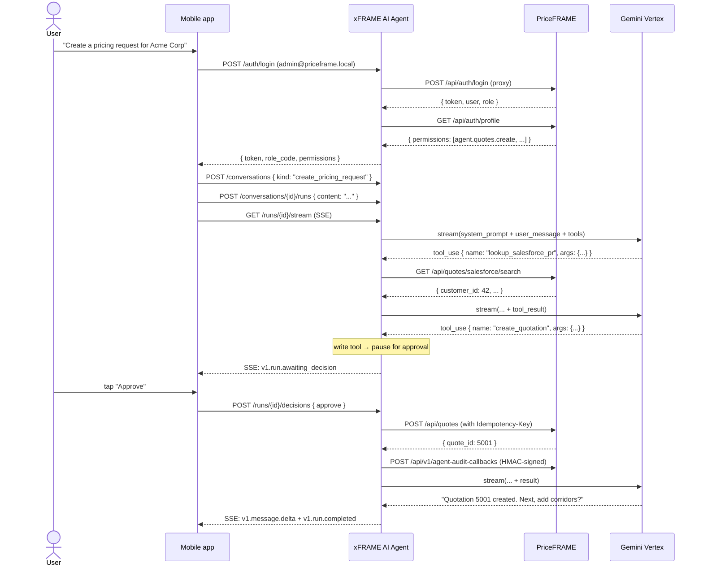
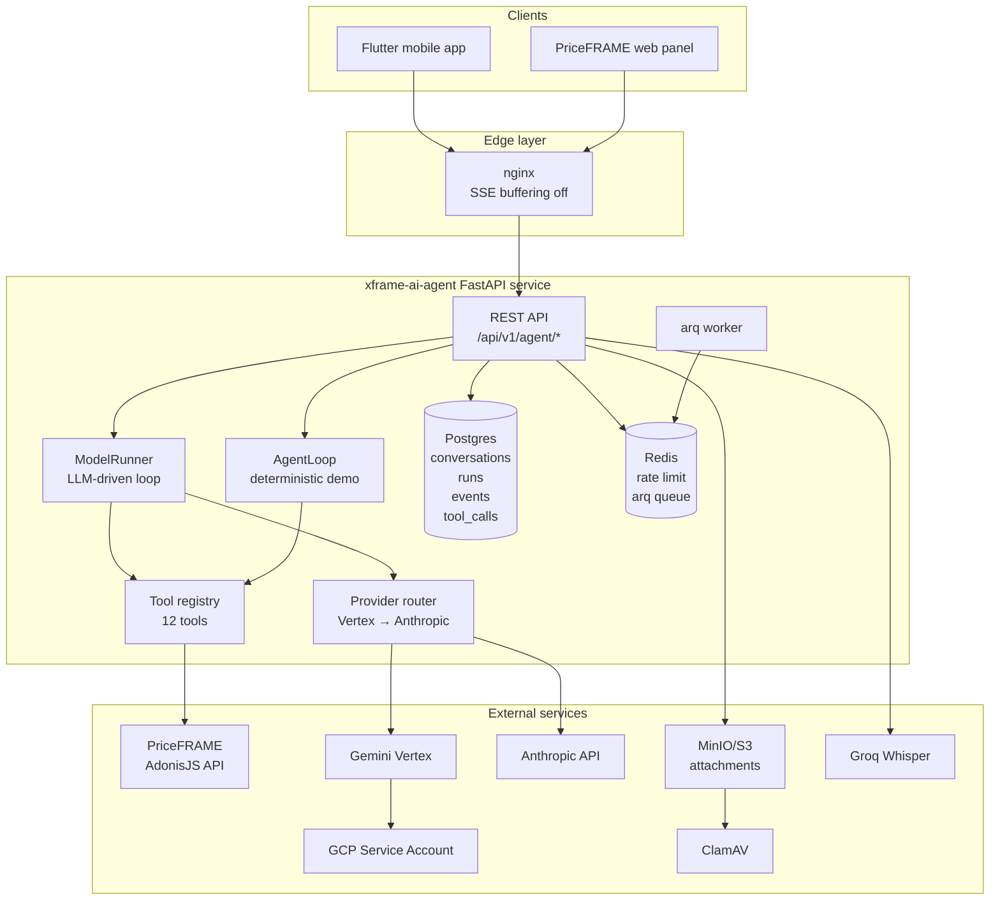

# 01 — Project Overview

## 1.1 What is the xFRAME AI Agent?

The **xFRAME AI Agent** is a Python/FastAPI service that gives sales representatives a **conversational interface** to **PriceFRAME**, a remittance pricing system. Through natural language ("Create a pricing request for Acme Corp at 0.02 spread for the India corridor"), the agent:

1. Understands intent via an LLM (Gemini Vertex primary, Anthropic fallback).
2. Calls structured PriceFRAME REST APIs through a **tool layer**.
3. Pauses for human approval before any **write** operation lands.
4. Records every step in a **durable event log** that mobile and web clients can replay over SSE.

It is **not** a chatbot. It is a goal-directed agent that plans multi-step workflows (look up customer → check rates → create quotation → add corridors → submit for approval) under strict guardrails.

## 1.2 Business objective

PriceFRAME's pricing workflow is dense: dozens of corridors per quote, FX spreads, term lengths, currency conversions, approval routing. Sales reps spend significant time clicking through forms. The agent reduces a 12-click multi-screen workflow to a few sentences while:

- **Preserving the system of record** — PriceFRAME remains authoritative for quotes, RBAC, audit, approvals.
- **Preserving compliance** — every write requires explicit human approval and produces an HMAC-signed audit callback.
- **Preserving auditability** — every reasoning step, tool call, approval decision, and result is persisted with sequence numbers.

## 1.3 Core use cases (v1 scope)

| Use case | Status |
|---|---|
| **Create Pricing Request** — guided 9-step flow (lookup customer → list corridors → check rate → create quote → add corridors → preview → adjust pricing → recalc → submit for approval) | ✅ v1 |
| **Lookup quotes** — "What's the status of quote 4231?" | ✅ v1 |
| **Adjust FX spread** — "Set spread to 0.015 on the India corridor for quote 4231" | ✅ v1 |
| **Salesforce PR lookup** — link to Salesforce pricing requests | ✅ v1 |
| Voice input | scaffolded (Groq Whisper) |
| Attachment OCR | scaffolded |
| Multi-conversation memory retrieval | scaffolded (no embeddings yet) |

## 1.4 Top-level user journey



## 1.5 High-level system map



## 1.6 System responsibilities

| Component | Owns | Does NOT own |
|---|---|---|
| **PriceFRAME** | Quotes, corridors, approvals, customer DB, RBAC, audit log | Conversation history, LLM reasoning |
| **xFRAME AI Agent** | Conversations, runs, events, tool proposals, idempotency replays | Authoritative quote state, user database |
| **LLM provider** | Reasoning, tool selection, text generation | Execution, persistence, authorization |
| **Mobile / web client** | Rendering, capturing approvals, SSE consumption | Backend logic, secrets |

The cardinal rule: **the agent service never holds elevated PriceFRAME credentials**. Every PriceFRAME call is made with the **end-user's own JWT**, so PriceFRAME's permission middleware stays authoritative.

## 1.7 End-to-end execution flow (one-liner)

> User sends a message → conversation row created → run row created → `ModelRunner.run()` opens a streaming connection to Gemini → model emits tool_use → tool validated against user permissions → if write, run pauses with `awaiting_decision` → user approves → tool executes via `PriceFrameClient` with user's JWT → PriceFRAME responds → tool result wrapped + appended → model continues → emits final text → run reaches `completed` → events streamed over SSE throughout.

For the full trace see [§05 Execution flow](./05-execution-flow.md).

## 1.8 Repository at a glance

```
xframe-ai-agent/
├── src/xframe_agent/
│   ├── main.py                 # FastAPI app factory
│   ├── settings.py             # All env vars
│   ├── agent/                  # Orchestration core (~1500 LOC)
│   │   ├── runner.py           # ModelRunner — LLM-driven loop
│   │   ├── loop.py             # AgentLoop — deterministic demo
│   │   ├── budget.py           # LoopBudget
│   │   ├── events.py           # Durable event log
│   │   ├── redaction.py        # PII redaction
│   │   ├── wrapping.py         # Tool-output wrapping
│   │   └── prompts/            # System prompts
│   ├── provider/               # LLM provider adapters
│   ├── tools/                  # Tool registry + 12 concrete tools
│   ├── priceframe/             # HTTP client + HMAC audit callback
│   ├── auth/                   # JWT verification + AuthContext
│   ├── api/v1/                 # REST endpoints
│   ├── models/                 # SQLAlchemy ORM
│   ├── schemas/                # Pydantic request/response
│   ├── db/                     # async session factory
│   ├── middleware/             # request_id + rate_limit
│   ├── observability/          # metrics + langfuse
│   └── attachments/            # S3 + ClamAV
├── tests/                      # 37 tests
├── evals/                      # Golden-trace eval harness
├── migrations/                 # Alembic schema
├── scripts/                    # entrypoint.sh, export_openapi.py
├── docs/
│   ├── ai-agent/               # Planning + phase handoffs + reference
│   ├── deploy/                 # Provider + deployment runbooks
│   └── handbook/               # This handbook
├── Dockerfile
├── docker-compose.yml          # Local dev stack
├── docker-compose.prod.yml     # Production stack
└── openapi.yaml                # Generated API contract
```

Detailed walkthrough: [§04 Source walkthrough](./04-source-walkthrough.md).

## 1.9 What's NOT in this system

To anchor your mental model, here is what the agent **deliberately does not** do:

- ❌ Hold a master PriceFRAME admin key. Every API call uses the end-user's JWT.
- ❌ Maintain its own quote database. PriceFRAME is the system of record.
- ❌ Auto-execute writes. All `LOW_RISK_WRITE` and `HIGH_RISK_WRITE` calls require explicit human approval.
- ❌ Run AI inference inside the service. All LLM calls go to a managed provider (Vertex or Anthropic).
- ❌ Embed and search past conversations. The `AgentMemory` table is scaffolded but no embeddings exist yet (see [§15 Improvements](./15-improvements.md)).
- ❌ Surface PII to the LLM. Emails, phone numbers, card numbers are redacted before any provider call.

---

**Next:** [§02 Fundamentals](./02-fundamentals.md) if you're new to AI agents; [§03 Architecture](./03-architecture.md) if you're ready for the component map.
