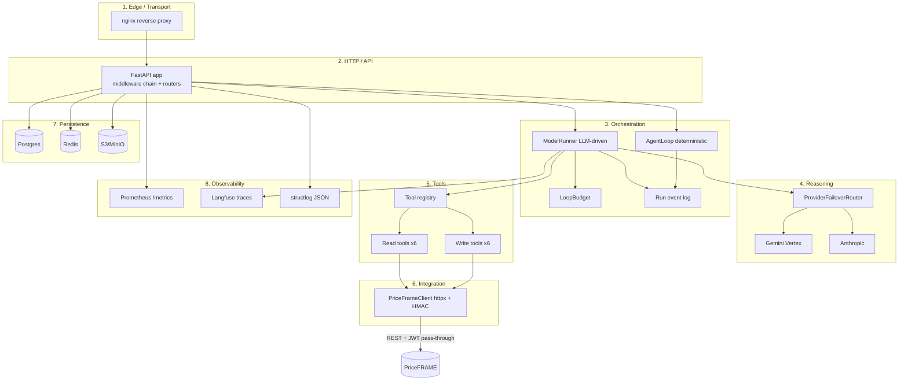
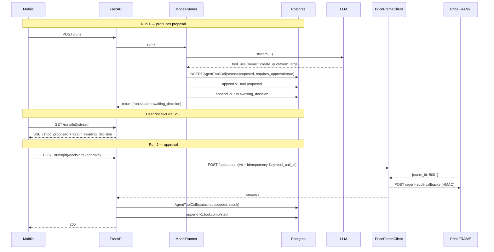
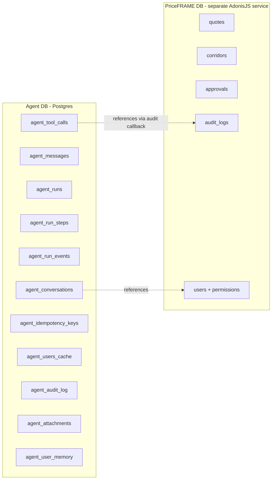
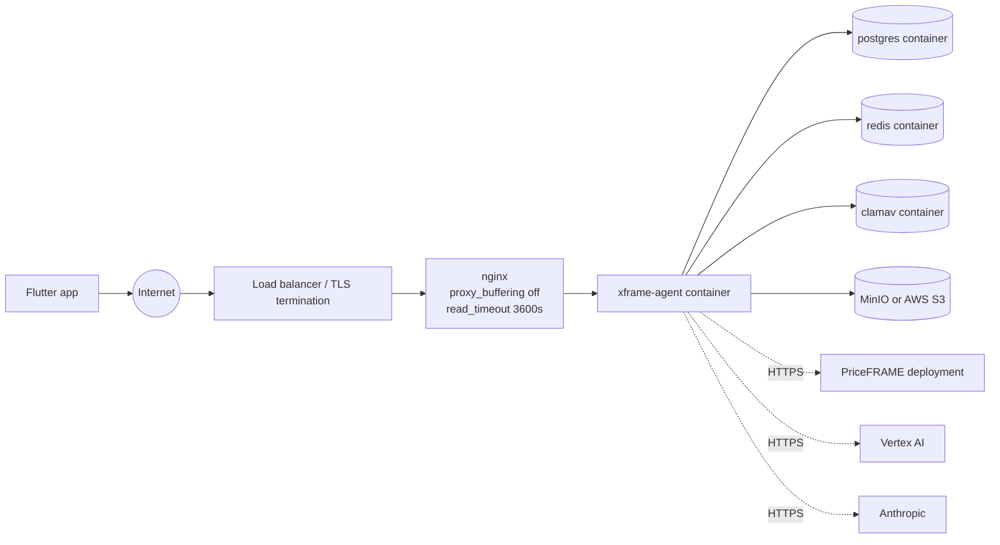

# 03 — System Architecture

> **Reading this section answers:** what are the components, what does each one own, how do they communicate, and where can things break?

## 3.1 Layered architecture



## 3.2 Component dependency table

| Component | Imports / depends on | Provides |
|---|---|---|
| `main.py` | settings, routers, middleware, exception handlers | `app: FastAPI` |
| `api/v1/router.py` | all sub-routers (`auth`, `conversations`, `runs`, `tools`, `attachments`, `memory`, `voice`, `health`) | mounted endpoints |
| `api/v1/conversations.py` | `AgentLoop`, idempotency, models, schemas | CRUD + run dispatch |
| `api/v1/runs.py` | events table, SSE, `PriceFrameClient`, audit callback | `/runs/*` endpoints |
| `agent/runner.py` (`ModelRunner`) | `ProviderFailoverRouter`, `LoopBudget`, `tool_registry`, `wrap_tool_output`, `redact`, `append_run_event`, `get_system_prompt` | `run(session, run, context, history) -> AgentRun` |
| `agent/loop.py` (`AgentLoop`) | `tool_registry`, `redact`, `append_run_event` | `run(session, run_id, context) -> AgentRun` |
| `provider/base.py` | none (pure Protocol) | `Provider`, `StreamEvent`, `ChatMessage`, `ProviderFailoverRouter` |
| `provider/gemini_vertex.py` | `google-genai` (lazy import) | `GeminiVertexProvider` |
| `provider/anthropic.py` | `anthropic` (lazy import) | `AnthropicProvider` |
| `tools/base.py` | Pydantic | `ToolDefinition` generic base |
| `tools/registry.py` | all 12 tool classes | `REGISTERED_TOOLS`, `tool_registry.available_for(auth)` |
| `tools/priceframe_read.py` | `PriceFrameClient` | 6 read tools |
| `tools/priceframe_write.py` | `PriceFrameClient` | 6 write tools |
| `priceframe/client.py` | `httpx` | `PriceFrameClient` with retries + audit callbacks |
| `auth/jwt.py` | `pyjwt` | `verify_priceframe_jwt`, `AuthContext` |
| `auth/dependencies.py` | `auth/jwt`, `priceframe/client` | FastAPI `Depends(get_auth_context)` |
| `models/agent.py` | SQLAlchemy | All ORM tables |
| `worker.py` | `arq`, `AgentLoop` | background job runner |

## 3.3 Two runners coexist (important architectural note)

There are **two orchestration paths** in the codebase:

| | `AgentLoop` (`agent/loop.py`) | `ModelRunner` (`agent/runner.py`) |
|---|---|---|
| Reasoning | **Deterministic** — regex `tool:{...}` directives | **LLM-driven** — provider streams tool_use blocks |
| Used by | `POST /conversations/{id}/messages` (`conversations.py:166`)<br/>`POST /conversations/{id}/runs` (`conversations.py:214`)<br/>`worker.run_agent_job` | Has all LLM logic but is **not yet wired into the HTTP layer** as of v1 |
| Provider required | No | Yes (Vertex or Anthropic) |
| Tool execution | Defers to `POST /runs/{id}/decisions` | Inline (reads parallel, writes serial) |
| System prompt injection | No | Yes — for `kind="create_pricing_request"` or empty history |
| Tested by | `test_agent_api.py`, `test_phase_e_api.py` | `test_runner.py`, `test_create_pricing_request_flow.py` |

**Why two?** `AgentLoop` was the Phase D/E deterministic demo path so the system could be E2E-tested without a real LLM. `ModelRunner` is the production path. The migration to ModelRunner being called from the HTTP layer is **engineering backlog** — see [§15 Improvements](./15-improvements.md) §15.1.

For day-to-day product usage (the v1 pricing-request demo against deployed PriceFRAME), the LLM-driven flow runs by directly invoking `ModelRunner.run()` from worker code or future endpoints. The HTTP entry today still goes through `AgentLoop`. The mismatch is a documented gap; you'll see it again in §10 (debugging) and §15.

## 3.4 Data flow — happy-path single tool call

```mermaid
sequenceDiagram
    participant Mobile
    participant API as FastAPI<br/>(conversations.py)
    participant Loop as AgentLoop / ModelRunner
    participant Tools as tool_registry
    participant PF as PriceFrameClient
    participant DB as Postgres
    participant LLM as Provider

    Mobile->>API: POST /messages {content}
    API->>DB: INSERT AgentMessage + AgentRun
    API->>Loop: run(session, run_id, context)
    Loop->>DB: append v1.run.started
    Loop->>LLM: stream(system + history + user)
    LLM-->>Loop: text_delta "Looking up..."
    LLM-->>Loop: tool_use {name: "get_quotation", args: {id:42}}
    LLM-->>Loop: usage {input_tokens, output_tokens}
    Loop->>DB: append v1.tool.proposed
    Loop->>Tools: get("get_quotation")
    Tools->>PF: GET /api/v1/quotes/42/pricing-context
    PF-->>Tools: {data: {...}}
    Tools-->>Loop: JsonOutput(data)
    Loop->>DB: append v1.tool.completed (with projected output)
    Loop->>LLM: stream(... + tool_result wrapped)
    LLM-->>Loop: text_delta "Quote 42 is..."
    Loop->>DB: append v1.message.delta + v1.run.completed
    API-->>Mobile: 200 {run_id, status: completed}
```

## 3.5 Data flow — write with HITL approval



## 3.6 Failure points and isolation strategies

| Failure | Detection | Isolation |
|---|---|---|
| LLM provider 5xx / timeout | `ProviderError` raised in stream | `ProviderFailoverRouter` marks unhealthy for 300s, tries next provider |
| PriceFRAME 5xx | `PriceFrameResponseError` | `PriceFrameClient` retries up to `max_retries` (default 2) with backoff |
| PriceFRAME 401 | `PriceFrameAuthError` | Tool returns error to model; model can ask user to re-login |
| Postgres unavailable | SQLAlchemy raises | request fails with 500; idempotency replays still work after recovery |
| Redis unavailable | Rate-limit middleware: fall back to in-memory | arq cannot enqueue → return 500 |
| LLM exceeds budget | `BudgetExceededError` in `LoopBudget` | Runner finalizes with `cause=cost_budget_exceeded` |
| Model loops on same tool | Loop detection at 3x same `(name, args)` | `LoopDetectedError` → `cause=loop_detected` |
| Prompt injection in tool result | `wrap_tool_output` escapes `</tool_output>` + flags as untrusted | System prompt instructs model to ignore directives inside |
| PII in user message | `redact()` substitutes `<PII:email>` etc. before provider call | Original never leaves the agent |
| Approval timeout (run sits in awaiting_decision for days) | None today | Manual cleanup; consider TTL job |

## 3.7 Concurrency model

| Layer | Concurrency primitive |
|---|---|
| FastAPI request handlers | asyncio cooperative multitasking under uvicorn |
| Postgres access | `AsyncSession` per request (factory in `db/session.py`) |
| LLM streaming | async generator yielding `StreamEvent` |
| Parallel tool reads | `asyncio.gather` with `Semaphore(max_parallel_tool_calls)` (default 3) in `ModelRunner._dispatch_proposals` |
| Serial tool writes | sequential `await` (no `gather`) — PriceFRAME's change-history append is not race-safe |
| Background runs | arq worker (max_jobs=4 by default in `worker.WorkerSettings`) |
| Rate limiting | per-client, per-path token bucket via Redis Lua script (fallback: in-memory deque) |

## 3.8 Persistence boundaries



**Key insight:** the agent's Postgres holds **conversation/run state**, not domain data. Quotes, corridors, customer records, RBAC live in PriceFRAME. The agent's `agent_audit_log` is a *local mirror* of audit events, not the authoritative log.

## 3.9 Network topology (production)



See [§13 Deployment](./13-deployment.md) for the actual `docker-compose.prod.yml` and nginx config.

## 3.10 What lives where (cheat sheet)

| You're looking for… | Open… |
|---|---|
| The HTTP endpoint definition | `src/xframe_agent/api/v1/<name>.py` |
| The reasoning loop | `src/xframe_agent/agent/runner.py` (LLM) or `agent/loop.py` (deterministic) |
| A tool's PriceFRAME API call | `src/xframe_agent/tools/priceframe_*.py` `_execute` method |
| The PriceFRAME REST contract | `src/xframe_agent/priceframe/client.py` + PriceFRAME repo |
| The system prompt | `src/xframe_agent/agent/prompts/create_pricing_request.py` |
| A database table | `src/xframe_agent/models/agent.py` |
| An env var | `src/xframe_agent/settings.py` |
| A test case | `tests/test_<subsystem>.py` |
| The HMAC signing logic | `src/xframe_agent/priceframe/client.py:post_agent_audit_callback` |

---

**Next:** [§04 Source walkthrough](./04-source-walkthrough.md) for a folder-by-folder code tour.
