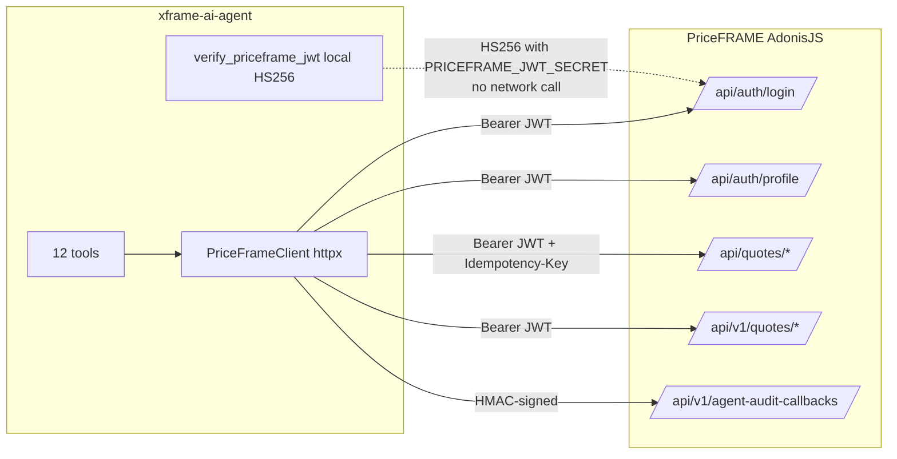
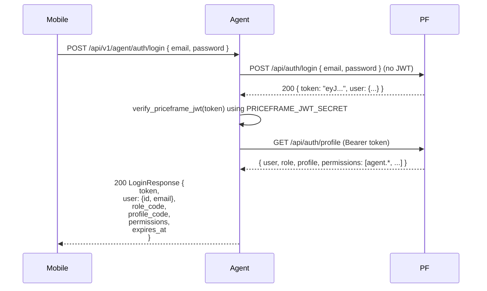

# 06 — PriceFRAME Integration

> **Reading this section answers:** how does the agent talk to PriceFRAME, what API endpoints does it call, how is auth handled, how are writes audited, what happens on failure?

## 6.1 Integration shape



**The cardinal pattern:** every PriceFRAME call carries the **end-user's JWT** in `Authorization: Bearer`. The agent service has no master key for PriceFRAME. PriceFRAME's existing permission middleware stays authoritative.

## 6.2 Authentication: how a user gets to the agent

### 6.2.1 Login (V1.2 proxy)



The mobile app stores `token` and uses it as the bearer on every subsequent agent call.

### 6.2.2 Subsequent requests

Every authenticated agent endpoint resolves `AuthContext` via:

```python
# auth/dependencies.py
1. Extract token from Authorization header (or ?token= for SSE)
2. verify_priceframe_jwt(token)
   → local HS256 check using PRICEFRAME_JWT_SECRET
   → returns TokenClaims(user_id, role_id, profile_id, session_id, ...)
   → NO network call
3. get_auth_context_from_profile(...)
   → uses 60s cache keyed by (token_hash, session_id)
   → on cache miss: GET /api/auth/profile on PriceFRAME with Bearer token
   → returns AuthContext(user_id, role_code, profile_code, permissions, jwt_raw, session_id)
```

Why two layers?

- **JWT verification** confirms the token was issued by PriceFRAME (not forged) — cheap, local.
- **Profile fetch** gets *current* permissions (a user's role can change in PriceFRAME mid-token-lifetime) — cached to avoid hammering PriceFRAME.

### 6.2.3 Refresh

```http
POST /api/v1/agent/auth/refresh { "refresh_token": "..." }
```

Pure proxy to `POST /api/auth/refresh` on PriceFRAME. Agent returns the new token + `expires_at`.

## 6.3 The 12 tool → endpoint mapping

| Tool | Method | Path | Permission | Notes |
|---|---|---|---|---|
| `list_my_quotations` | GET | `/api/quotes?owner_id=me&...` | `agent.quotes.read` | Owner-scoped server-side |
| `get_quotation` | GET | `/api/v1/quotes/{id}/pricing-context` | `agent.quotes.read` | Composite pricing read |
| `list_corridors_available` | GET | `/api/corridors/active` | `agent.quotes.read` | Unfiltered active list (gap: should accept filters at scale) |
| `get_currency_rate` | GET | `/api/app-config/currency-rates?currency=USD` | `agent.quotes.read` | |
| `lookup_salesforce_pr` | GET | `/api/quotes/salesforce/search?q={query}` | `agent.salesforce.read` | |
| `recalculate_quote_aggregates` | POST | `/api/quotes/{id}/recalculate-aggregates` | `agent.quotes.recalc` | No body. Risk=READ in registry but mutates server state — special case |
| `preview_pricing_change` | POST | `/api/v1/quotes/{id}/pricing/preview` | `agent.quotes.recalc` | Non-persistent — no audit callback |
| `create_quotation` | POST | `/api/quotes` | `agent.quotes.create` | Idempotency-Key=tool_call_id |
| `bulk_add_corridors` | POST | `/api/quotes/{quote_id}/corridors/bulk` | `agent.quotes.edit` | |
| `update_corridor_pricing` | PUT | `/api/quote-corridors/{corridor_id}` | `agent.quotes.edit` | |
| `set_fx_spread` | PUT | `/api/quote-corridors/{corridor_id}` | `agent.quotes.edit` | Local validation `applied >= minimum` before call |
| `submit_for_approval` | POST | `/api/quotes/{quote_id}/approvals` | `agent.approvals.submit` | Always HIGH_RISK_WRITE |

## 6.4 Payload transformations (V1.5 typed inputs)

The LLM sees clean Pythonic schemas; PriceFRAME expects camelCase + nested. Each tool's `_execute()` does the translation.

**Example — `create_quotation`:**

LLM emits:
```json
{
  "name": "create_quotation",
  "args": { "title": "Acme Pricing", "customer_id": 42, "currency": "USD", "notes": "Q1 batch" }
}
```

Tool transforms (`tools/priceframe_write.py:117-130`):
```python
payload = {
    "title": args.title,
    "customerId": args.customer_id,
    "currency": args.currency,
}
if args.notes:
    payload["notes"] = args.notes
response = await priceframe.post_json("/api/quotes", jwt_raw=ctx.jwt_raw, json=payload, headers={"Idempotency-Key": tool_call_id})
```

**Example — `bulk_add_corridors`** (`tools/priceframe_write.py:148-168`):

```python
{
  "quote_id": 5001,
  "corridors": [
    { "corridor_id": 12, "volume": "5000.00", "term_months": 12,
      "applied_rate": "0.072", "fx_spread": "0.015" }
  ]
}
```

Transformed:

```python
{
  "quoteId": 5001,
  "corridors": [{
    "corridorId": 12, "volume": "5000.00", "termMonths": 12,
    "appliedRate": "0.072", "fxSpread": "0.015"
  }]
}
```

`Decimal` fields are converted to strings (`str(d)`) to preserve precision through JSON.

## 6.5 PriceFrameClient internals

`src/xframe_agent/priceframe/client.py` (214 lines).

### 6.5.1 Construction

```python
client = PriceFrameClient.from_settings(settings)
```

Configures `httpx.AsyncClient` with:

- `base_url = PRICEFRAME_BASE_URL` (e.g., `https://priceframe-yg.buy-frame.com`)
- `timeout = PRICEFRAME_TIMEOUT_SECONDS` (default 10s)
- `headers = {"Accept": "application/json"}`

### 6.5.2 Request method (`client.py:170-189`)

```python
async def _request(self, method, path, **kwargs):
    last_error = None
    for attempt in range(self._max_retries + 1):
        try:
            response = await self._client.request(method, path, **kwargs)
            if response.status_code < 500:
                return response   # don't retry 4xx
            last_error = self._error_for(response)
        except httpx.TransportError as e:
            last_error = PriceFrameTimeoutError(str(e))
        if attempt < self._max_retries:
            await asyncio.sleep(0.1 * (2 ** attempt))   # 100ms, 200ms, 400ms
    raise last_error
```

Defaults: `max_retries=2`, so up to 3 attempts. Retries only on 5xx or transport errors — 4xx is not retried (auth, validation).

### 6.5.3 Error mapping (`client.py:192-202`)

```python
def _error_for(self, response):
    if response.status_code == 401: return PriceFrameAuthError(...)
    if response.status_code == 403: return PriceFrameForbiddenError(...)
    if response.status_code == 404: return PriceFrameNotFoundError(...)
    return PriceFrameResponseError(...)
```

These propagate up to the tool's `_execute()` and eventually to the run's `v1.tool.error` event (or, if uncaught, the run terminates with `cause=tool_error`).

### 6.5.4 Idempotency to PriceFRAME

For write tools, the agent passes:

```python
await priceframe.post_json(
    "/api/quotes",
    jwt_raw=ctx.jwt_raw,
    json=payload,
    headers={"Idempotency-Key": tool_call_id},
)
```

PriceFRAME's own idempotency middleware uses this to dedupe — if the agent approves the same tool call twice (network retry), PriceFRAME returns the prior response instead of creating two quotations.

## 6.6 Audit callbacks (HMAC-signed)

After every executed write, the agent posts an audit callback so PriceFRAME can record the action server-side.

`client.py:139-168`:

```python
async def post_agent_audit_callback(self, *, jwt_raw, service_secret, payload):
    timestamp = str(int(time.time() * 1000))
    sig_body = json.dumps(dict(payload), separators=(",", ":"))
    signature = hmac.new(
        service_secret.encode("utf-8"),
        f"{timestamp}.{sig_body}".encode(),
        sha256,
    ).hexdigest()
    headers = {
        "Authorization": f"Bearer {jwt_raw}",
        "X-Agent-Timestamp": timestamp,
        "X-Agent-Service-Signature": signature,
        "Content-Type": "application/json",
    }
    response = await self._client.post("/api/v1/agent-audit-callbacks", headers=headers, content=sig_body)
    # expect { audit_log_id: 42 }
```

**Why both JWT and HMAC?**

- JWT authenticates the **user** the action was attributed to.
- HMAC authenticates the **agent service** (so PriceFRAME knows this is a real agent callback, not an arbitrary client). Without HMAC, anyone holding a user JWT could spoof audit entries.

PriceFRAME verifies:

1. JWT is valid for `user_id` in payload.
2. `X-Agent-Service-Signature` matches `HMAC(service_secret, "{timestamp}.{body}")`.
3. `X-Agent-Timestamp` is within a freshness window (typically 5 min) to prevent replay.

If verification succeeds, PriceFRAME inserts a row into its `audit_logs` table and returns the new id. The agent stores this in `agent_tool_calls.priceframe_audit_log_id` for cross-system traceability.

The audit-callback flow is currently triggered from the **decisions endpoint** (`api/v1/runs.py`) when a write is approved. See [§12 Security](./12-security-safety.md) §12.5 for the threat model.

## 6.7 Error scenarios and recovery

| Scenario | Detection | Agent response | User-facing effect |
|---|---|---|---|
| PriceFRAME returns 401 (token expired mid-run) | `PriceFrameAuthError` | Tool raises; run finalizes with cause=tool_error | Frontend should refresh token + retry from current state |
| PriceFRAME returns 403 (permission revoked mid-run) | `PriceFrameForbiddenError` | Tool raises | Model receives error; can respond "you no longer have permission" |
| PriceFRAME returns 404 (referenced ID doesn't exist) | `PriceFrameNotFoundError` | Tool raises | Model can ask user to recheck the ID |
| PriceFRAME returns 5xx | Retried up to 2 times with backoff | If still failing: tool raises | Model can apologize or retry from a fresh angle |
| Network timeout | `PriceFrameTimeoutError` | Retried | Same |
| HMAC verification fails on PriceFRAME side | 401 / 403 from `/agent-audit-callbacks` | Surface as warning; agent's local audit row still written | Compliance team should investigate clock skew or secret rotation |

## 6.8 PriceFRAME prerequisites checklist

For the agent to function against a PriceFRAME deployment, PriceFRAME must:

- [x] Run AdonisJS API with all routes used in §6.3.
- [x] Expose `GET /api/auth/profile` returning `{ user, role, profile, permissions }`.
- [x] Expose `GET /api/v1/quotes/{id}/pricing-context` (composite read).
- [x] Expose `POST /api/v1/quotes/{id}/pricing/preview` (non-persistent preview).
- [x] Expose `POST /api/v1/agent-audit-callbacks` with HMAC verification.
- [x] Have the **`agent.*` permission codes seeded** on the user's profile (`agent.enabled`, `agent.quotes.read`, `agent.quotes.create`, `agent.quotes.edit`, `agent.quotes.recalc`, `agent.approvals.submit`, `agent.salesforce.read`).
- [x] Share the **same `PRICEFRAME_JWT_SECRET`** for HS256 verification on both sides.
- [x] Share the **same `PRICEFRAME_SERVICE_SECRET`** for HMAC callback verification.
- [x] Have CORS origins configured to allow the agent (or `*` for proxied setups).

If any of `agent.*` permissions are missing from the user's PriceFRAME profile, the corresponding tools will be **invisible** to the LLM (filtered out by `tool_registry.available_for`). This is silent — the model just doesn't know the tool exists. See [§10 Debugging](./10-debugging-guide.md) §10.5.

## 6.9 Configuration reference for the integration

| Env var | Used by | Notes |
|---|---|---|
| `PRICEFRAME_BASE_URL` | `PriceFrameClient` | Production: `https://priceframe-yg.buy-frame.com` |
| `PRICEFRAME_JWT_SECRET` | `verify_priceframe_jwt` | Must match PriceFRAME's HS256 signing key |
| `PRICEFRAME_SERVICE_SECRET` | `post_agent_audit_callback` HMAC | Must match PriceFRAME's expected secret |
| `PRICEFRAME_JWT_ALGORITHM` | `verify_priceframe_jwt` | Default `HS256` |
| `PRICEFRAME_PROFILE_CACHE_TTL_SECONDS` | `get_auth_context_from_profile` | 60s default — trade-off between freshness and load |
| `PRICEFRAME_TIMEOUT_SECONDS` | `PriceFrameClient` | 10s default |
| `PRICEFRAME_MAX_RETRIES` | `PriceFrameClient._request` | 2 default (so up to 3 attempts total) |

---

**Next:** [§07 Prompt engineering](./07-prompt-engineering.md) for the system-prompt + injection-defense deep dive.
