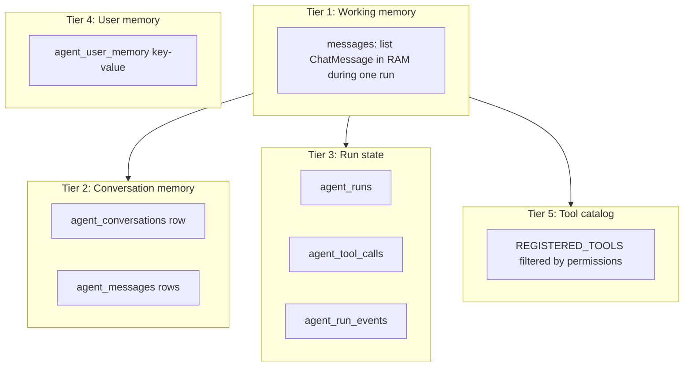
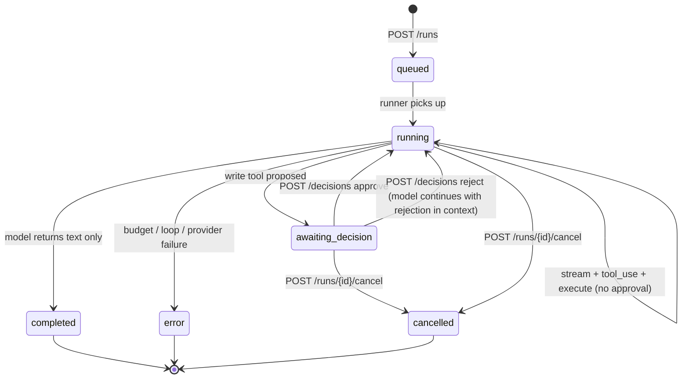

# 08 — Memory, Context, and Reasoning

> **Reading this section answers:** how does the agent remember things? Where is state stored? How is reasoning sequenced across multiple steps?

## 8.1 The memory tiers (what xFRAME has today vs the standard taxonomy)



| Tier | Where | Lifetime | Used for | Status |
|---|---|---|---|---|
| 1. Working memory | in-process Python list | one `ModelRunner.run()` call | what the model sees this turn | ✅ |
| 2. Conversation memory | `agent_conversations` + `agent_messages` | until `deleted_at` set | next-turn context | ✅ |
| 3. Run state | `agent_runs` + `agent_tool_calls` + `agent_run_events` | indefinite | SSE replay, debugging, audit | ✅ |
| 4. User memory | `agent_user_memory` | user-controlled (delete via API) | future RAG / personalization | ⚠️ table exists, no retrieval logic |
| 5. Tool catalog | `tool_registry` | process lifetime | what the model can do | ✅ |

What's NOT here yet (see [§15 Improvements](./15-improvements.md)):

- ❌ Vector embeddings of past conversations for similarity search
- ❌ Semantic search over PriceFRAME entities
- ❌ Long-term summarization of multi-day workflows

## 8.2 Working memory (one run's context)

Inside `ModelRunner.run()`, the local variable `messages: list[ChatMessage]` is the entire context the model will see this turn. It contains:

```
[0]   system    "You are xFRAME AI Agent. ... [user permissions] ... [9-step flow] ..."
[1]   user      "Create a pricing request for Acme Corp"
[2]   assistant "I'll look that up. <tool_use: lookup_salesforce_pr>"
[3]   tool      <tool_output name=lookup_salesforce_pr>...</tool_output>
[4]   assistant "Found Acme Corp (customer_id=42). Now listing corridors. <tool_use: list_corridors_available>"
[5]   tool      <tool_output name=list_corridors_available>...</tool_output>
...
```

After each provider call:

1. Assistant text → persisted as `AgentMessage` AND appended to `messages` locally (implicitly via the next iteration loading from history; but in current code the runner relies on the model's own continuation in the stream).
2. Each tool result → appended as `ChatMessage(role="tool", ...)` (`runner.py:202-220`).

The list grows by ~2-3 messages per tool round. Token count grows by roughly the size of tool outputs (which is why `project_for_model` matters).

## 8.3 The durable event log (the source of truth)

`agent_run_events` is **append-only** and **sequenced**. Every state change has an event.

### 8.3.1 The full event taxonomy

| Event type | Emitted by | Payload | Terminal? |
|---|---|---|---|
| `v1.run.started` | `AgentLoop` | `{}` | no |
| `v1.step.started` | `ModelRunner` | `{step: int, kind: "model_call"\|"tool_call"}` | no |
| `v1.step.completed` | `ModelRunner` | `{step, kind, usage: {input_tokens, output_tokens}}` | no |
| `v1.message.delta` | `ModelRunner`, `AgentLoop` | `{message_id, delta}` | no |
| `v1.tool.proposed` | `ModelRunner`, `AgentLoop` | `{tool_call_id, tool_name, args, requires_approval}` | no |
| `v1.tool.started` | `ModelRunner` | `{tool_call_id, tool_name}` | no |
| `v1.tool.completed` | `ModelRunner` | `{tool_call_id, result}` | no |
| `v1.tool.error` | `ModelRunner` | `{cause, name, detail?}` | no |
| `v1.tool.approved` | decisions endpoint | `{tool_call_id, edited_args?}` | no |
| `v1.tool.rejected` | decisions endpoint | `{tool_call_id}` | no |
| `v1.memory.updated` | `AgentLoop` | `{key}` | no |
| `v1.run.awaiting_decision` | `ModelRunner` | `{tool_call_id}` | **yes** |
| `v1.run.completed` | `ModelRunner` | `{budget: snapshot}` | **yes** |
| `v1.run.error` | `ModelRunner` | `{cause, message, budget}` | **yes** |
| `v1.heartbeat` | SSE generator only (not persisted) | `{run_id, seq}` | no |

### 8.3.2 Why event-sourcing?

- **Replayability** — an SSE client that disconnects can reconnect with `Last-Event-ID: 17` and see everything since seq 17 in correct order.
- **Multi-client fan-out** — mobile app + desktop session + admin debugger can all read the same stream.
- **Audit** — every state change has a row. You can reconstruct what the agent did from the events alone.
- **Crash recovery** — if the runner crashes mid-step, the events already written are durable.

### 8.3.3 Atomic sequence numbering

`events.py:14-37`:

```python
async def append_run_event(session, *, run_id, event_type, payload):
    result = await session.execute(
        select(func.coalesce(func.max(AgentRunEvent.seq), 0) + 1)
        .where(AgentRunEvent.run_id == run_id)
    )
    seq = int(result.scalar_one())
    event = AgentRunEvent(run_id=run_id, seq=seq, ...)
    session.add(event)
    await session.flush()
```

The `(run_id, seq)` unique constraint guarantees monotonicity. If two coroutines append concurrently, one will fail the unique constraint and SQLAlchemy will raise — the caller must retry. In practice, all event appends within one run are serialized by the runner's single async loop, so contention is impossible.

## 8.4 Conversation continuity across runs

When the user sends a second message in the same conversation:

1. `POST /messages` creates a new `AgentRun`.
2. The runner loads conversation history via `agent_messages` ordered by `created_at`.
3. Messages are converted to `ChatMessage`s. Tool results from prior runs are included.
4. The system prompt is re-injected (V1.4 behavior: only if `kind=create_pricing_request` or empty history).
5. The new user message is appended.
6. Stream to provider — model sees the full prior context.

**This means conversations can be very long.** Each new run re-sends all prior messages → input tokens scale linearly with conversation length → cost scales quadratically with the number of turns.

**Mitigations available today:**

- Budget hard ceiling (`max_input_tokens_per_run = 50,000`) kills runs that get too long.
- `project_for_model` strips unnecessary fields from tool results before they enter messages.

**Mitigations not yet implemented** (see [§15 Improvements](./15-improvements.md) §15.2):

- Summarize older turns into a single system message.
- Context-cache the system prompt + tool schemas on the provider side.
- RAG over conversation history (vector search instead of full-text replay).

## 8.5 The reasoning loop visualized



The reasoning is **driven by the model**. The runner doesn't have a hardcoded plan — it just translates model outputs into actions and feeds outcomes back.

## 8.6 The "tool memory" — what the agent knows it can do

`tool_registry.available_for(ctx)` returns tools matching `tool.permission in ctx.permissions`. So if `ctx.permissions = ("agent.quotes.read",)` only the four read tools requiring that permission are exposed. The LLM sees only those in the tools parameter.

**Why this matters for reasoning:**

- The model **cannot call** a tool not in the list, regardless of what the user asks.
- The model is **less likely to suggest** an action it can't perform.
- The prompt context is **smaller** when permissions are limited.

**The flip side:** if a user is missing the `agent.quotes.create` permission, the model literally cannot create a quote, even if the user explicitly asks. The model will say something like "I don't have the ability to create quotations for your role."

## 8.7 User memory (forward-looking)

The `agent_user_memory` table holds key/value rows per user:

| Column | Example |
|---|---|
| `user_id` | 42 |
| `key` | "preferred_corridor" |
| `value` | "India" |
| `source` | "summarizer" |
| `metadata` | `{...}` |

Exposed via `GET /memory` and `DELETE /memory/{id}` for user-controlled deletion (GDPR right-to-be-forgotten).

Today, **nothing writes to or reads from this table** in the active code paths. It's a scaffold for future RAG-style memory injection. Plans:

- A periodic summarizer that reads recent conversations and writes facts to memory.
- Memory injection into the system prompt (top-N relevant facts).
- Embeddings for semantic retrieval (would need pgvector).

## 8.8 Context-window arithmetic

Quick sanity math for Gemini 2.5 Flash (1M context, ~$0.10/$0.40 per 1M in/out tokens):

| Scenario | Approx input tokens | Cost/turn | Cost/10-turn conversation |
|---|---|---|---|
| Single quick read ("show my quotes") | ~3K (system + tools + history + result) | $0.0003 | — |
| Full Create Pricing Request flow (8 tool rounds) | ~8K per round, growing | ~$0.0008 per round | ~$0.008 |
| Same flow at conversation turn #20 (lots of history) | ~25K per round | ~$0.0025 | — |

The `LoopBudget` hard ceiling `cost_hard_per_run_usd = $0.60` corresponds to roughly 6M input tokens at Gemini Flash rates — orders of magnitude above what a reasonable session needs. The ceiling is a safety net against pathological behavior, not a per-message limit.

## 8.9 Crash and restart semantics

| Failure | What's lost | What survives |
|---|---|---|
| Agent process crashes mid-`ModelRunner.run()` | The in-RAM `messages: list[ChatMessage]` | All events written so far; `agent_runs.status` stays as last committed value |
| Postgres connection drops between events | The unwritten event | Prior events; the run will appear stuck in `running` |
| Provider stream interrupted | Partial assistant text not persisted | All persisted events |
| Worker (arq) container restarted | Job in flight is requeued (arq retry) | n/a |

There is **no automatic restart of in-flight runs** today. A run that was `running` at the time of a crash will be visible in the events but stuck — it requires an operator to cancel and re-issue. This is a known gap.

## 8.10 Debug: inspecting state

```sql
-- Most recent run's full event timeline
SELECT seq, event_type, payload, created_at
FROM agent_run_events
WHERE run_id = $1
ORDER BY seq;

-- All tool calls for a run
SELECT id, tool_name, status, requires_approval, args, result, error
FROM agent_tool_calls
WHERE run_id = $1;

-- Conversation history rendered for the model
SELECT role, source, content, created_at
FROM agent_messages
WHERE conversation_id = $1
ORDER BY created_at;
```

For SSE-side debugging see [§10 Debugging](./10-debugging-guide.md) §10.7.

---

**Next:** [§09 Testing strategy](./09-testing-strategy.md) — how to verify all of this works.
