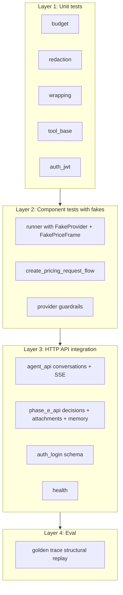

# 09 — Testing Strategy

> **Reading this section answers:** how do you verify the agent works? What tests exist, what do they cover, what gaps remain, and how do you add new tests?

## 9.1 Test pyramid for this codebase



Totals: **37 tests** across 11 test files + 1 eval file. Run with `uv run pytest`.

## 9.2 Test inventory

| File | Tests | Lines | Validates |
|---|---|---|---|
| `tests/test_budget.py` | 5 | 70 | `LoopBudget` ceilings (steps, tool calls, input/output tokens, cost, wall clock) → raise `BudgetExceededError` with correct cause |
| `tests/test_redaction_wrapping.py` | 6 | 53 | PII patterns substituted; `<tool_output>` tag escaping; control chars stripped; redaction audit metadata |
| `tests/test_tool_base.py` | 4 | 88 | `requires_approval` defaults; `project_for_model` allowlist; typed input validation for `CreateQuotationTool`; permission check raises |
| `tests/test_runner.py` | 4 | 339 | `ModelRunner`: read auto-execute + complete; write pause; 3x same tool → `loop_detected`; provider error → `provider_error` |
| `tests/test_create_pricing_request_flow.py` | 2 | 209 | System prompt injection on `kind=create_pricing_request`; `create_quotation` pause to `awaiting_decision` |
| `tests/test_agent_api.py` | 2 | 106 | E2E conversation + run via HTTP; SSE event types; tool catalog filtered by permission |
| `tests/test_phase_e_api.py` | 6 | 298 | Decision approve → executes + writes audit; reject; attachment upload + scan; memory CRUD; voice 503 when Groq unset |
| `tests/test_auth_jwt.py` | 3 | 108 | JWT verify happy path; expired token rejected; profile cache hits |
| `tests/test_auth_login.py` | 2 | 37 | `LoginRequest`/`LoginResponse` Pydantic shapes (no HTTP) |
| `tests/test_provider.py` | 1 | 19 | `GeminiAIStudioProvider` refuses to instantiate when `allow_real_data=true` |
| `tests/test_health.py` | 1 | 20 | `/health` returns 200 when externals disabled |
| `evals/test_eval_ci.py` | 1 | 16 | All 5 golden traces' expected `tool_sequence` and `final_status` match |

## 9.3 Key fixture patterns

### 9.3.1 The in-memory sqlite engine

Every test that touches DB uses an aiosqlite in-memory DB:

```python
database_url = f"sqlite+aiosqlite:///{tmp_path / 'agent.db'}"
engine = create_async_engine(database_url)
async with engine.begin() as conn:
    await conn.run_sync(Base.metadata.create_all)
factory = async_sessionmaker(engine, expire_on_commit=False)
```

This gives you a fresh DB per test in `<1ms` setup time. `tmp_path` ensures isolation.

### 9.3.2 `FakeProvider` — scriptable LLM stub

`tests/test_runner.py:39-58` and `tests/test_create_pricing_request_flow.py:28-48`:

```python
class FakeProvider:
    name = "fake"
    def __init__(self, script: list[StreamEvent]) -> None:
        self._script = script
        self.calls: list[list[ChatMessage]] = []

    async def stream(self, messages, tools, *, model, max_output_tokens):
        self.calls.append(list(messages))   # record what was sent
        for event in self._script:
            yield event
```

Use it like:

```python
provider = FakeProvider(script=[
    StreamEvent(kind="tool_use", payload={"name": "get_quotation", "args": {"id": 1}, "call_id": "c1"}),
    StreamEvent(kind="usage", payload={"input_tokens": 100, "output_tokens": 5}),
])
router = ProviderFailoverRouter(providers=[provider])
runner = ModelRunner(router=router, settings=s, model="fake", priceframe_factory=FakePriceFrame())
await runner.run(session, run=run, context=AUTH, history=[user_msg])

# Now: provider.calls[0] is the messages sent on the first call
# provider.calls[1] is the second call (after tool result append)
```

### 9.3.3 `FakePriceFrame` — async context manager

```python
class FakePriceFrame:
    async def __aenter__(self): return self
    async def __aexit__(self, *_): return None
    async def get_json(self, *_args, **_kw): return {"id": 1}
    async def post_json(self, *_args, **_kw): return {"id": 1}
```

`tests/test_phase_e_api.py:31-65` has a richer version that **records calls** for assertion:

```python
class FakePriceFrameClient:
    def __init__(self):
        self.calls = []
        self.audit_payloads = []
    async def post_json(self, path, *, jwt_raw, json, headers=None):
        self.calls.append(("post", path, json, headers, jwt_raw))
        return {"id": 5001}
```

### 9.3.4 `AuthContext` fixture

```python
_AUTH = AuthContext(
    user_id=7,
    role_code="ROLE_AM_SALES",
    profile_code="PROFILE_SALES",
    permissions=("agent.enabled", "agent.quotes.read", "agent.quotes.create", ...),
    jwt_raw="jwt-for-tests",
    session_id=42,
)
```

For HTTP tests, inject via FastAPI dep override:

```python
app.dependency_overrides[get_auth_context] = lambda: _AUTH
```

## 9.4 Running tests

```bash
# Everything
uv run pytest

# One file with verbose output
uv run pytest tests/test_runner.py -v

# One test
uv run pytest tests/test_runner.py::test_read_tool_auto_executes -v

# With coverage
uv run pytest --cov=src/xframe_agent

# Eval only
uv run pytest evals/

# Parallel (warning: tests share PostgreSQL containers if you use real DB)
uv run pytest -n auto
```

## 9.5 The 5 testing levels

### Level 1: Static checks (CI gate)

Run on every PR:

```bash
uv run ruff format --check .
uv run ruff check .
uv run mypy
uv run pytest
uv run python scripts/export_openapi.py
git diff --exit-code openapi.yaml   # schema drift detection
```

`mypy` runs in strict mode; type errors fail CI. `openapi.yaml` drift means someone changed a schema without regenerating — fail-fast.

### Level 2: Unit tests

Pure functions. Mock nothing — give real inputs, assert outputs.

**Example — `LoopBudget`** (`tests/test_budget.py:25-69`):

```python
def test_step_budget_exceeded():
    s = Settings(max_steps_per_run=2, ...)
    b = LoopBudget(settings=s)
    b.begin_step()  # steps=1
    b.begin_step()  # steps=2
    with pytest.raises(BudgetExceededError) as exc:
        b.begin_step()  # steps=3 → raise
    assert exc.value.cause == "step_budget_exceeded"
```

### Level 3: Component tests with fakes

These test orchestration without a real LLM or real HTTP. The `FakeProvider`/`FakePriceFrame` pattern.

**Example — write pause** (`tests/test_runner.py`):

```python
async def test_write_tool_pauses_run():
    provider = FakeProvider(script=[
        StreamEvent(kind="tool_use", payload={
            "name": "create_quotation",
            "args": {"title": "Q1", "customer_id": 42, "currency": "USD"},
            "call_id": "c1",
        }),
        StreamEvent(kind="usage", payload={"input_tokens": 100, "output_tokens": 10}),
    ])
    runner = ModelRunner(router=ProviderFailoverRouter(providers=[provider]), ...)
    result = await runner.run(session, run=run, context=AUTH, history=[user_msg])

    assert result.status == "awaiting_decision"
    tool_calls = await session.execute(select(AgentToolCall).where(...))
    assert tool_calls[0].status == "proposed"
    assert tool_calls[0].requires_approval is True
```

### Level 4: HTTP integration tests

These spin up the full FastAPI app via `AsyncClient`/`TestClient`, with sqlite + fake auth + fake PriceFRAME.

**Example — full conversation + run + SSE** (`tests/test_agent_api.py`):

```python
async def test_message_creates_run_and_stream(agent_client):
    response = await agent_client.post("/api/v1/agent/conversations",
        json={"title": "test"}, headers={"Idempotency-Key": "k1"})
    cid = response.json()["id"]
    response = await agent_client.post(f"/api/v1/agent/conversations/{cid}/messages",
        json={"content": "hi", "source": "text"})
    assert response.status_code == 200
    rid = response.json()["run_id"]
    async with agent_client.stream("GET", f"/api/v1/agent/runs/{rid}/stream") as resp:
        events = [...parse SSE...]
        types = [e["event"] for e in events]
        assert "v1.run.started" in types
        assert "v1.run.completed" in types
```

### Level 5: Eval (behavioral)

Golden traces in `evals/golden/*.json`:

```json
{
  "name": "create_pricing_request_happy_path",
  "input": "Create a pricing request for Acme at 0.02 spread for India",
  "expected_tools": ["lookup_salesforce_pr", "list_corridors_available", "create_quotation", ...],
  "expected_final_status": "completed"
}
```

`evals/test_eval_ci.py` validates each trace **structurally** (the declared expectations are present in the JSON). Switch to **provider mode** for real LLM replay:

```bash
XFRAME_EVAL_MODE=provider XFRAME_JUDGE_MODE=llm GEMINI_VERTEX_PROJECT=... \
uv run pytest evals/
```

The judge layer (`evals/judge.py`) defaults to string equality; with `XFRAME_JUDGE_MODE=llm` it dispatches to Claude with a rubric prompt for free-text comparison.

## 9.6 What's NOT yet covered (and recommendations)

| Gap | Impact | Suggested test |
|---|---|---|
| ❌ Full LLM-driven flow via HTTP (current API calls `AgentLoop`, not `ModelRunner`) | Once `ModelRunner` is wired to HTTP, today's tests cover the runner directly but not the HTTP transition | Add `tests/test_runner_http_integration.py` once wired |
| ❌ Provider failover (router falling through to next provider) | Hard to reproduce without two configured providers | Mock two `FakeProvider`s; first raises `ProviderError(failover=True)`; assert second is called |
| ❌ Audit callback HMAC signing live | If `service_secret` doesn't match PriceFRAME, agent writes succeed but audit fails | Mock PriceFRAME, assert headers contain `X-Agent-Service-Signature` with expected HMAC |
| ❌ SSE reconnection with `Last-Event-ID` | Mobile clients depend on this | Add test that consumes some events, closes stream, reconnects with `Last-Event-ID`, asserts no duplicate events |
| ❌ Rate limit middleware | 429 path untested | Hit endpoint 121+ times in 60s, assert 429 + `Retry-After` |
| ❌ Idempotency replay TTL expiry | If TTL is wrong, behavior diverges silently | Set short TTL, store, wait, assert miss |
| ❌ Long-conversation token explosion | Budget kicks in but path untested | Build a 50-message history; assert `LoopBudget` aborts cleanly |
| ❌ Prompt injection attempt end-to-end | Defense exists but not E2E tested | Feed crafted tool result through `wrap_tool_output`; assert model in real run ignores |
| ⚠️ Provider mode evals depend on live LLM access | Won't run in CI without credentials | Keep structural mode for CI; provider mode for scheduled jobs |

## 9.7 Test-writing checklist for new code

When adding a feature:

- [ ] **Unit:** every new pure function has a test with edge cases (empty input, max input, invalid input).
- [ ] **Component:** if it's in `agent/runner.py` or `agent/loop.py`, add a `FakeProvider`-based test that exercises the new code path. Assert on:
  - State persisted (rows in tables)
  - Events emitted (`agent_run_events` for the run)
  - The final `run.status`
- [ ] **HTTP integration:** if it's a new endpoint, add a test that hits it via `AsyncClient` with auth override.
- [ ] **OpenAPI:** run `uv run python scripts/export_openapi.py` and commit the diff.
- [ ] **Eval (optional):** if it changes user-visible LLM behavior, add a golden trace.
- [ ] **mypy strict:** all new code typed; no `Any` unless justified.
- [ ] **Static gate:** `uv run ruff format --check . && uv run ruff check . && uv run mypy` clean.

## 9.8 Property-based testing (recommended next step)

The codebase doesn't yet use Hypothesis. Good targets:

- `redact(text)` — for any input, output should contain no email-like, phone-like, or card-like patterns.
- `wrap_tool_output(...)` — for any payload, output should be parseable as JSON when un-wrapped.
- `LoopBudget.record_usage` — for any non-negative inputs, `cost_usd` should be monotonically non-decreasing.

```python
from hypothesis import given, strategies as st

@given(st.text(), st.text())
def test_redact_no_pii_in_output(left, right):
    text = f"{left} foo@bar.com {right}"
    out = redact(text).text
    assert "foo@bar.com" not in out
```

## 9.9 Load and chaos testing (operational)

Not in the test suite; do these as part of a deployment runbook.

**Load profile to validate:**

- 10 concurrent users, 1 message per 10s, for 30 min — verify P95 latency, no errors, budget usage steady.
- 100 concurrent SSE subscribers on different runs — verify no FD exhaustion, memory bounded.

**Chaos to inject:**

- Kill Postgres for 30s during a run — verify the run errors cleanly with an error event.
- Throttle Redis to 10 req/s — verify rate-limit middleware degrades gracefully (or falls back to in-memory).
- Block egress to Vertex for 60s — verify router fails over to Anthropic and the user sees no disruption (other than possibly slower first-token latency).

---

**Next:** [§10 Debugging guide](./10-debugging-guide.md) — when tests pass but production breaks.
