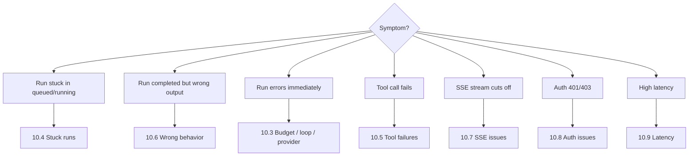

# 10 — Debugging Guide

> **Reading this section answers:** when something is wrong, how do you find the cause? Where do you look first?

## 10.1 The 5-minute triage flow



For *any* issue, the first three things to grab are:

1. **Run ID** from the user's report or the HTTP response.
2. **Events for that run** — `SELECT * FROM agent_run_events WHERE run_id = $1 ORDER BY seq` — this is the single most useful query in the system.
3. **Request ID** from logs — every log line in a request carries `X-Request-ID`; filter to it.

## 10.2 Where to look first

| If the issue is… | Look here first |
|---|---|
| LLM-related (wrong tool, hallucinated args, weird output) | Provider trace in Langfuse → exact prompt sent + exact response received |
| Tool-related (wrong PriceFRAME call, 4xx from PriceFRAME) | `agent_tool_calls` row → `args`, `result`, `error` |
| State-related (run stuck, status wrong) | `agent_run_events` → the timeline of what *did* happen |
| Auth-related | structlog logs filtered by `X-Request-ID`; look for `verify_priceframe_jwt` lines |
| Transport (SSE, CORS, headers) | nginx access log + `curl -v -N` against the endpoint directly |
| Performance | Prometheus `/metrics` + DB slow query log |

## 10.3 Run finalized with `cause=...`

When a run's `v1.run.error` event fires, the payload's `cause` field tells you why. The full list and remediations:

| `cause` | What happened | Where to look | Fix |
|---|---|---|---|
| `step_budget_exceeded` | More than `MAX_STEPS_PER_RUN` (default 10) | Look at the `v1.step.started` events — is the model making good progress or thrashing? | Increase `MAX_STEPS_PER_RUN`, or refine system prompt to be more decisive |
| `tool_call_budget_exceeded` | More than `MAX_TOOL_CALLS_PER_RUN` (default 15) | Inspect `agent_tool_calls` — is the model calling read tools repeatedly? | System prompt fix: "don't re-fetch the same data twice" |
| `input_token_budget_exceeded` | Conversation got too long | Compute total tokens in messages; check tool result sizes | Trim conversation history; use `project_for_model` more aggressively |
| `output_token_budget_exceeded` | Model generated more than `MAX_OUTPUT_TOKENS_PER_RUN` (default 8000) | Look at assistant messages — is the model writing essays? | Add "be concise" to system prompt |
| `cost_budget_exceeded` | Cost exceeded `COST_HARD_PER_RUN_USD` (default $0.60) | `v1.run.error` payload includes `budget.cost_usd` | Either raise the ceiling for this user/role, or fix the underlying explosion |
| `wall_clock_budget_exceeded` | Run took longer than `MAX_WALL_CLOCK_PER_RUN_S` (default 60s) | Slow PriceFRAME or slow LLM | Profile; check provider timeouts; PriceFRAME health |
| `loop_detected` | Same tool+args called 3x in a row | `v1.tool.proposed` events show the repeating call | Likely a model failure — the tool returns "no results" and the model re-tries the same query. Improve tool error message or system prompt |
| `provider_error` | All providers failed | Check provider health metrics; check API key/quotas | Rotate keys; check Vertex billing; check Anthropic status |
| `tool_error` (uncaught from `_execute`) | A tool raised an unhandled exception | `agent_tool_calls.error` field; provider logs | Fix tool or add error handling in `_execute` |

## 10.4 Stuck runs

A run sitting in `queued` or `running` for minutes is usually one of:

| Status | Likely cause | Investigation |
|---|---|---|
| `queued` for >10s | arq worker not running or queue backed up | `docker ps` → check `xframe-worker` container; `redis-cli LLEN agent-runs` |
| `running` indefinitely | Stuck waiting on LLM stream (e.g., Vertex stalling) or PriceFRAME timing out | Check provider trace (Langfuse); check egress to provider; check `httpx` timeout settings |
| `awaiting_decision` for hours/days | User didn't approve | This is expected — there's no TTL today |

**To unstick:**

```sql
UPDATE agent_runs SET status = 'cancelled', cancelled_at = NOW(), updated_at = NOW()
WHERE id = $1 AND status IN ('queued', 'running');
```

Then `POST /runs/{id}/cancel` for clean cancellation.

## 10.5 Tool call failures

### 10.5.1 "Unknown tool" event

```
v1.tool.error {"cause": "unknown_tool", "name": "create_quote"}
```

The model invented a tool name. Causes:

1. **Hallucination** — model misremembered the name (e.g., `create_quote` instead of `create_quotation`). Fix: explicit tool names in system prompt + few-shot example.
2. **Permission filter** — the user lacks the permission, so the tool was filtered out of `available_for(ctx)`. The model "remembered" the tool from somewhere (the system prompt!) and tried to use it. **Fix:** either grant the permission in PriceFRAME, or rewrite the prompt to be permission-aware.

### 10.5.2 Schema validation failed

```
v1.tool.error {"cause": "schema_validation_failed", "name": "create_quotation", "detail": "..."}
```

The model produced args that Pydantic rejected. Common cases:

- **Missing required field** — system prompt should remind to gather all required fields first.
- **Wrong type** — model wrote `"customer_id": "42"` (string) instead of `42` (int). The schema says int. Real fix is in the JSON Schema itself (already correct in this codebase), but the model sometimes hallucinates.
- **Out-of-range** — `currency` longer than 3 chars; `term_months < 1`.

The model will see the error message via the next stream (the harness can feed errors back as tool_result with status="error"; the current implementation does *not* do this — it just emits the event and the model never knows). This is a known gap; see [§15 Improvements](./15-improvements.md) §15.5.

### 10.5.3 Tool execution exception

```
agent_tool_calls.status = 'failed', agent_tool_calls.error = '...'
```

PriceFRAME returned 4xx/5xx, or HTTP timeout, or the tool's own validation (`SetFxSpreadTool` checks `applied >= minimum`) raised. Inspect:

```sql
SELECT tool_name, args, error, status FROM agent_tool_calls WHERE id = $1;
```

If the error is HTTP from PriceFRAME, the error string includes the status code and PriceFRAME's response body.

## 10.6 Wrong behavior (model misbehavior)

The run finishes cleanly but the model did the wrong thing. Triage:

1. **Open Langfuse trace** for the run. Inspect the exact prompts.
2. **Did the model have the right tool?** Check `available_for(ctx)` for this user. If the right tool is missing → permission issue (see §10.5.1).
3. **Did the model pick the wrong tool?** The system prompt may need a clearer "if X then call Y" instruction.
4. **Were args wrong?** Look at `agent_tool_calls.args`. Common: model used a customer ID it pulled from a malformed prior tool result. Check `model_visible_fields` — is the LLM seeing fields it shouldn't?
5. **Did the model talk past the user's intent?** Check redaction — did PII redaction strip something the model needed?

For prompt-related debugging, see [§07 Prompt engineering](./07-prompt-engineering.md) §7.8.

## 10.7 SSE issues

### Symptom: client never receives any events

Causes:

- **Auth failure** — SSE endpoint requires JWT. Browser `EventSource` can't set custom headers, so JWT must be in `?token=...`. The endpoint accepts both.
- **CORS** — verify `CORSMiddleware.allow_origins` includes the client's origin.
- **nginx buffering** — if behind nginx and you set `proxy_buffering on` (or didn't disable it), nginx will hold events until disconnect. Set `proxy_buffering off`.

### Symptom: events arrive in burst at end instead of streamed

- **uvicorn workers** — make sure you're running uvicorn (or hypercorn), not a sync server.
- **gzip in middleware** — gzip will buffer the body. Don't compress SSE responses.

### Symptom: stream cuts off after some time

- **Idle timeout** — nginx/load-balancer cuts the connection after `proxy_read_timeout`. Heartbeats every 15s should keep it alive; check that `SSE_HEARTBEAT_SECONDS` < (your timeout - 5s).
- **Run completed terminal event** — that's actually the correct behavior; the stream is supposed to close.

### Symptom: client reconnects but misses events

- **`Last-Event-ID` not sent** — check the client implementation. `EventSource` should send it automatically on reconnect.
- **`SSE_REPLAY_EVENT_LIMIT` too small** — default 2000 should cover any run, but if you've been streaming for a very long time…

**Manual test:**

```bash
curl -N -H "Authorization: Bearer $TOKEN" \
  https://agent.example.com/api/v1/agent/runs/{run_id}/stream
```

You should see one event per line `event: v1.X\ndata: {...}\n\n` and heartbeats every 15s.

## 10.8 Auth issues

### Symptom: 401 on every endpoint

- Token expired. Refresh via `POST /auth/refresh`.
- `PRICEFRAME_JWT_SECRET` mismatch between agent and PriceFRAME. Token was issued by PriceFRAME with secret A, agent verifies with secret B → signature check fails.

### Symptom: 200 from `/auth/login`, but 403 from tools

The user logged in successfully but lacks the necessary `agent.*` permissions on their PriceFRAME profile. Check:

```bash
curl https://agent.example.com/api/v1/agent/auth/me -H "Authorization: Bearer $TOKEN" | jq .permissions
```

If `agent.quotes.create` (etc.) is missing, the tool will be filtered from `available_for` and the model will literally not see it. PriceFRAME-side fix: add the permission to the user's profile.

### Symptom: works locally, 401 in production

- Profile cache TTL — production token may be older than `PRICEFRAME_PROFILE_CACHE_TTL_SECONDS=60`, but that just causes a fresh fetch.
- Clock skew — JWT `exp` enforcement; if the agent's clock is ahead, valid tokens look expired.

## 10.9 Latency

| Symptom | Likely cause | Investigation |
|---|---|---|
| First-token latency > 3s | Cold LLM provider | Vertex Gemini Flash typical TTFT ~500ms; if higher, check `GEMINI_VERTEX_LOCATION` (use closest region) |
| Tool round-trip > 1s | PriceFRAME slow | Inspect PriceFRAME logs; check DB indexes on PriceFRAME side |
| Total run > 30s | Many tool rounds | Count `v1.tool.completed` events. If >5, the prompt is too eager — refine |
| P99 latency spike | GC pause, container CPU throttling | `docker stats`; consider increasing memory limit |

Useful Prometheus queries:

```promql
histogram_quantile(0.95, rate(http_request_duration_seconds_bucket[5m]))
rate(agent_runs_total{status="completed"}[5m])
```

## 10.10 Troubleshooting matrix

| Error in logs | Root cause | Fix |
|---|---|---|
| `PriceFrameAuthError: 401` | User's JWT invalid or expired | Client must re-login |
| `PriceFrameForbiddenError: 403` | User lacks permission for the operation on PriceFRAME side | Update PriceFRAME role/profile |
| `PriceFrameNotFoundError: 404` | Referenced ID doesn't exist | Model hallucinated the ID; refine prompt |
| `PriceFrameResponseError: 5xx` | PriceFRAME down or overloaded | Check PriceFRAME health; agent retried 3 times |
| `ProviderError: ...` | LLM provider auth/quota/network | Check API key, project quota, network egress |
| `BudgetExceededError: cause=...` | One of the LoopBudget ceilings hit | See §10.3 |
| `LoopDetectedError: tool_name` | Model in a loop | See §10.3 |
| `OperationalError: connection refused` | Postgres unreachable | Check container; restart if needed |
| `RedisError: connection refused` | Redis unreachable | Falls back to in-memory rate limit; arq enqueue fails |

## 10.11 Common error catalog (FastAPI exception handlers)

After V1.7, every error response uses the same envelope:

```json
{
  "error": {
    "code": "validation_error",
    "message": "Request validation failed",
    "detail": "..."
  }
}
```

| HTTP status | `code` | Cause |
|---|---|---|
| 401 | `http_401` | Invalid/expired JWT |
| 403 | `http_403` | Missing permission |
| 404 | `http_404` | Resource not found |
| 422 | `validation_error` | Pydantic schema rejection on request body |
| 429 | `http_429` | Rate limit |
| 500 | `internal_error` | Uncaught exception (last-resort handler) |
| 502 | `http_502` | PriceFRAME / provider gateway error |
| 503 | `http_503` | Voice unavailable (no Groq key); `/health` reports a dependency down |

Clients should display `error.message` and log `error.detail`.

## 10.12 Local repro script

When triaging a production issue:

```bash
# 1. capture the run
psql -d xframe_agent -c "SELECT * FROM agent_run_events WHERE run_id='$RUN_ID' ORDER BY seq" > /tmp/events.txt
psql -d xframe_agent -c "SELECT * FROM agent_tool_calls WHERE run_id='$RUN_ID'" > /tmp/tools.txt

# 2. capture the messages
psql -d xframe_agent -c "SELECT role, source, content FROM agent_messages WHERE conversation_id='$CONV_ID' ORDER BY created_at" > /tmp/messages.txt

# 3. start a local stack
docker compose up -d postgres redis
uv run alembic upgrade head
uv run uvicorn xframe_agent.main:app --reload --port 8000

# 4. replay using a test JWT
TOKEN=$(python -c "import jwt; print(jwt.encode({'user_id': 1, 'role_id': 1, 'profile_id': 1, 'session_id': 1, 'exp': 9999999999}, 'x'*32, 'HS256'))")
curl -X POST localhost:8000/api/v1/agent/conversations -H "Authorization: Bearer $TOKEN" -d '{"title":"repro","kind":"create_pricing_request"}'
```

## 10.13 When all else fails

- Check Langfuse for the LLM trace — provides exact prompt + response that no logs can replicate.
- Diff against last known-good commit: `git log --oneline -- src/xframe_agent/agent/runner.py`.
- Bisect tools: temporarily filter `REGISTERED_TOOLS` to only the suspects and reproduce.
- Ask the model to debug itself: switch the LLM provider in test (Claude vs Gemini) to see if the misbehavior is provider-specific.

---

**Next:** [§11 Observability](./11-observability.md) — what to instrument so debugging gets faster.
