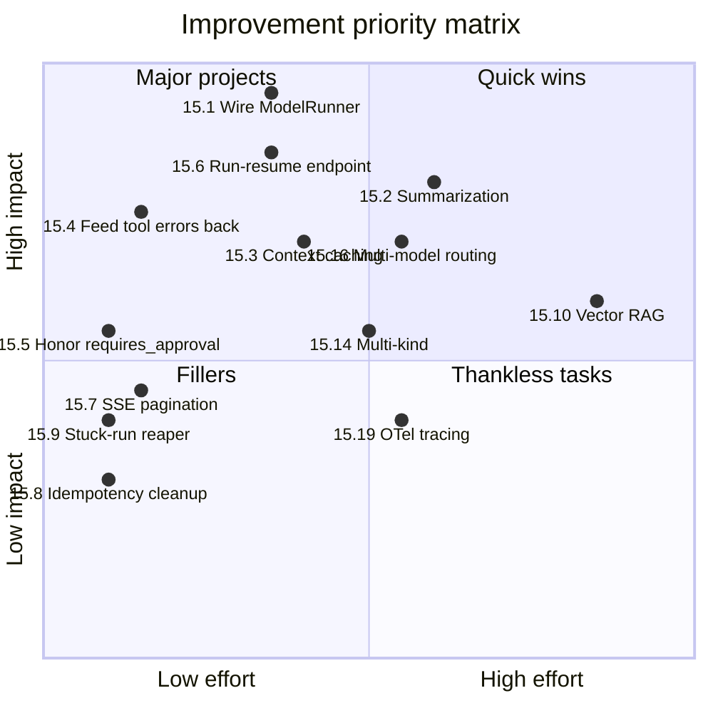

# 15 — Improvement Recommendations

> A prioritized backlog of architectural improvements based on the current codebase. Each entry: what, why, effort, and impact.

## Priority levels

- 🔴 **High** — blocks scale, correctness, or significant capability
- 🟡 **Medium** — clear value, no urgency
- 🟢 **Low** — quality of life, future-proofing

---

## 15.1 🔴 Wire `ModelRunner` into the HTTP path

**What:** today `POST /messages` and `POST /runs` call `AgentLoop` (`conversations.py:166, 214`); `ModelRunner` is fully implemented but unused from HTTP. The arq worker also calls `AgentLoop`.

**Why:** all the LLM-driven logic (system prompt injection, streaming, parallel reads, loop detection, budget enforcement, provider failover) lives in `ModelRunner` and is *not* exercised from production HTTP entry. The v1 user-facing flow falls back to deterministic regex parsing.

**Effort:** ~1 day.

**Impact:** unlocks the actual LLM behavior the rest of the system was built for.

**Sketch:**

```python
# conversations.py / runs.py
if settings.provider_configured:
    router = ProviderFailoverRouter(providers=_build_providers(settings))
    runner = ModelRunner(router=router, settings=settings, model=settings.default_model,
                         priceframe_factory=PriceFrameClient.from_settings(settings))
    await runner.run(session, run=run, context=auth, history=_load_history(session, conversation_id))
else:
    await AgentLoop().run(session, run_id=run.id, context=auth)
```

Same change in `worker.run_agent_job`.

Tests to add: `tests/test_model_runner_http_integration.py` that asserts the LLM-driven path runs end-to-end.

---

## 15.2 🔴 Conversation summarization for long histories

**What:** when conversation length exceeds a threshold (say 30 messages), summarize older turns into one system message before sending to the LLM.

**Why:** input tokens grow linearly with conversation length → cost grows roughly linearly with turn count *and* model gets distracted by stale context.

**Effort:** ~2 days.

**Impact:** order-of-magnitude cost reduction for long conversations; better model performance.

**Sketch:**

```python
def trim_history(history: list[ChatMessage], max_tokens: int) -> list[ChatMessage]:
    if estimate_tokens(history) < max_tokens:
        return history
    summary = call_llm_for_summary(history[:-10])
    return [ChatMessage(role="system", content=[ContentBlock(type="text", payload={"text": summary})])] + history[-10:]
```

Run as a pre-step in `ModelRunner.run()`.

---

## 15.3 🟡 Provider context caching

**What:** use vendor caching features:

- Anthropic: `cache_control: {"type": "ephemeral"}` on system message + tool schemas.
- Vertex: context caching API.

**Why:** the system prompt + tool catalog is ~2-5K tokens that's identical across all calls in a conversation. Caching cuts the per-call cost ~80% for input.

**Effort:** ~1 day per provider (smaller for Anthropic).

**Impact:** large cost reduction at moderate scale.

**Where:** `provider/anthropic.py` and `provider/gemini_vertex.py` `stream()` methods.

---

## 15.4 🟡 Feed tool errors back to the model

**What:** when `tool.input_model.model_validate` fails or PriceFRAME returns 4xx, the runner emits `v1.tool.error` but the model **never sees the error**. Currently the proposal is silently dropped.

**Why:** the model can't self-correct because it doesn't know the call failed. Result: the model assumes success and proceeds with wrong assumptions.

**Effort:** ~half day.

**Impact:** significantly better recovery behavior; fewer wedged runs.

**Sketch:**

```python
# In _dispatch_proposals after schema_validation_failed
messages.append(ChatMessage(
    role="tool",
    content=[ContentBlock(type="tool_result", payload={
        "tool_call_id": proposal.call_id,
        "wrapped": wrap_tool_output(
            tool_name=proposal.name,
            call_id=proposal.call_id,
            payload={"error": "schema_validation_failed", "detail": str(exc)},
        ),
    })],
))
```

Then continue the loop; the model gets a chance to fix args.

---

## 15.5 🟡 Use `requires_approval()` for tool record approval (HITL bug fix)

**What:** in `AgentLoop`, every tool call is currently created with `requires_approval=True` regardless of the tool's actual policy.

**Why:** `recalculate_quote_aggregates` overrides `requires_approval -> False` but the loop hardcodes True, so users have to approve recalcs unnecessarily.

**Effort:** ~2 hours.

**Impact:** UX improvement; consistency between `AgentLoop` and `ModelRunner`.

**Sketch:**

```python
# In AgentLoop._build_tool_proposal
requires_approval = await tool.requires_approval(parsed, ctx)
tool_call = AgentToolCall(..., requires_approval=requires_approval, status="proposed" if requires_approval else "pending")
```

Then the decisions endpoint logic still applies for `status=proposed`, but `status=pending` can be auto-executed (with appropriate guarding).

---

## 15.6 🟡 Run-resume endpoint

**What:** today, after `/decisions` approves a tool call, the run needs to continue. Currently the decisions handler executes the tool but the loop continuation is not wired through `ModelRunner.run()`.

**Why:** the model needs to see the tool result and decide the next step. Without resumption, the conversation just stops after each approval.

**Effort:** ~1 day.

**Impact:** essential for multi-step flows where multiple writes happen.

**Sketch:**

```python
# In /decisions handler after successful approve
if settings.run_execution_mode == "inline":
    runner = ModelRunner(...)
    await runner.run(session, run=run, context=auth, history=_load_history(session, conv_id))
else:
    await enqueue_agent_run(settings, run_id=run.id, auth_context=auth)
```

---

## 15.7 🟡 SSE replay limit pagination

**What:** SSE replay reads up to `SSE_REPLAY_EVENT_LIMIT=2000` events. For runs with >2000 events (chatty test runs or large flows), the client gets truncated history.

**Why:** correctness; current limit silently caps.

**Effort:** ~half day.

**Impact:** correctness; supports longer runs.

**Sketch:** in the SSE generator, loop until no more events or terminal state:

```python
while True:
    batch = await list_run_events(session, run_id=..., after_seq=cursor, limit=2000)
    if not batch: break
    for e in batch:
        yield ...
        cursor = e.seq
    if emitted_terminal or run.status in TERMINAL_STATUSES:
        break
```

---

## 15.8 🟡 Idempotency key cleanup job

**What:** `agent_idempotency_keys` accumulates rows; `expires_at` is set but no cleanup.

**Why:** table grows unboundedly. Replay lookup queries get slower over time.

**Effort:** ~2 hours.

**Impact:** operational.

**Sketch:** add an arq cron:

```python
@cron(hour=3, minute=0)
async def clean_expired_idempotency_keys(ctx):
    async with session_factory() as s:
        await s.execute(delete(AgentIdempotencyKey).where(AgentIdempotencyKey.expires_at < utc_now()))
        await s.commit()
```

---

## 15.9 🟡 Stuck-run reaper

**What:** runs in `running` or `queued` for > 10× wall-clock budget should be auto-cancelled.

**Why:** crashes leave runs orphaned in those states; no automatic cleanup.

**Effort:** ~2 hours.

**Impact:** operational hygiene.

**Sketch:** arq cron at 1-minute interval:

```python
threshold = utc_now() - timedelta(seconds=settings.max_wall_clock_per_run_s * 10)
await s.execute(
    update(AgentRun)
    .where(AgentRun.status.in_(("queued", "running")), AgentRun.updated_at < threshold)
    .values(status="error", error="reaper: stuck > 10x wallclock", completed_at=utc_now())
)
```

Also emit `v1.run.error { cause: "reaper" }`.

---

## 15.10 🟢 Vector embeddings + RAG

**What:** populate `agent_user_memory` from conversation summaries; embed; retrieve top-K relevant items into the system prompt.

**Why:** persistent learning across conversations ("the user prefers India corridor with 0.015 spread").

**Effort:** ~1 week. Needs pgvector + embedding model + summarizer + retrieval logic.

**Impact:** materially better personalization for power users.

---

## 15.11 🟢 Property-based tests with Hypothesis

**What:** add Hypothesis to `dev` deps; write property tests for redaction, wrapping, budget arithmetic.

**Why:** catches edge cases unit tests miss.

**Effort:** ~half day initial.

**Impact:** quality.

---

## 15.12 🟢 Structured "tool_error" stream events for client UX

**What:** today `v1.tool.error` is emitted to the durable log but the SSE event taxonomy could be more granular (`v1.tool.permission_denied`, `v1.tool.upstream_5xx`, etc.).

**Why:** the frontend can show better-targeted error UI.

**Effort:** ~1 day.

**Impact:** UX polish.

---

## 15.13 🟢 Run-level metrics

**What:** Prometheus counters/histograms for `agent_runs_total{status}`, `agent_tool_calls_total{tool_name,status}`, `agent_provider_latency_seconds{provider}`, etc.

**Why:** dashboards in §11 reference these; today they aren't all emitted.

**Effort:** ~1 day.

**Impact:** operational visibility.

---

## 15.14 🟢 Multi-conversation kinds

**What:** the `kind` field on conversations supports arbitrary strings, but only `create_pricing_request` has a prompt. Adding more kinds (`approve_pending_quotes`, `corridor_analysis`, etc.) gives each flow a tailored system prompt + tool subset.

**Why:** simpler prompts per use case → better model performance.

**Effort:** ~1 day per kind.

**Impact:** scales the product.

**Sketch:**

```python
# In runner.run()
prompt_loader = PROMPT_REGISTRY.get(conv_kind, default_system_prompt)
system_text = prompt_loader(role_code=..., profile_code=..., permissions=...)
```

Per-kind tool filtering can also restrict the visible tool catalog further.

---

## 15.15 🟢 Native voice → tool flow

**What:** `POST /voice/transcriptions` exists (Groq Whisper) but the result is just text — there's no pipeline to feed it directly into a run.

**Why:** sales reps in the field talk faster than they type.

**Effort:** ~1 day.

**Impact:** UX.

**Sketch:** add a `POST /conversations/{id}/voice-messages` that transcribes inline, persists as `AgentMessage(source="voice")`, then starts a run.

---

## 15.16 🟢 Multi-model routing

**What:** route by query complexity — cheap model (Gemini Flash) for trivial reads, smarter model (Claude Sonnet) for complex multi-tool plans.

**Why:** 5-10x cost reduction for the long tail of "show me my quotes" type requests.

**Effort:** ~2 days (classifier + routing logic).

**Impact:** cost.

---

## 15.17 🟢 Auto-retry on PII redaction mistakes

**What:** if a model output looks like it tried to include a redacted value (e.g., the model writes `<PII:email>` literally in its response), detect and ask the model to rephrase.

**Why:** the literal placeholder leaking through is rare but jarring.

**Effort:** ~half day.

**Impact:** polish.

---

## 15.18 🟢 Adopt `httpx` streaming for PriceFRAME large reads

**What:** for endpoints that may return large payloads (`/api/corridors/active` could grow), stream the response instead of buffering.

**Why:** memory + time-to-first-byte.

**Effort:** ~half day.

**Impact:** only matters at scale.

---

## 15.19 🟢 Distributed tracing (OpenTelemetry)

**What:** instrument with OTel for end-to-end spans across agent → provider → PriceFRAME.

**Why:** Langfuse covers LLM but not PriceFRAME / DB; OTel ties them.

**Effort:** ~2 days.

**Impact:** operational.

---

## 15.20 🟢 Per-user budgets

**What:** `LoopBudget` is per-run. Add per-user daily / monthly budgets that read from a `agent_user_budgets` table.

**Why:** prevent a single rogue user from running up costs.

**Effort:** ~2 days.

**Impact:** cost governance.

---

## Prioritization summary



---

**Next:** [glossary](./glossary.md) for term definitions or [faq](./faq.md) for common questions.
